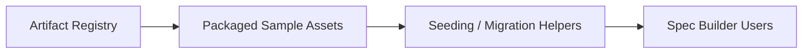

[CodeWiki](../../../../../index.md) / [Artifacts](../../../../index.md) / [pages](../../index.md)

# Architecture Spec: Refresh Packaged Spec Builder Sample Assets

## Overview
This sample architecture spec demonstrates how a packaged Spec Builder document can describe a small but concrete maintenance change. The goal is to restore realistic sample assets under the packaged `source_assets/samples/` bundle so seeded examples match the current artifact registry and skill expectations.

## Context
Spec Builder packages both JSON and Markdown examples so maintainers and downstream tooling have reference artifacts to inspect. Placeholder content weakens those references because it no longer communicates current field expectations, document structure, or cross-artifact linkage patterns.

## Decision
The packaged samples should remain lightweight but complete enough to illustrate the modern contract for each artifact. JSON samples will include stable ids, correct `type` values, and representative linkage fields. Markdown samples will include front matter, breadcrumbs, and artifact-specific sections that align with the current skill instructions.

## Components
The affected components are the packaged registry, the sample asset bundle, and the consumers that surface those examples in seeded CodeWiki output.

## Interfaces
The registry defines the canonical sample locations under `kavia-docs/CodeWiki/Artifacts/SpecBuilder/json/_samples/` and `.../pages/_samples/`. The packaged source assets mirror those shapes from `CodeGenerationAgent/src/code_generation_core_agent/spec_builder/source_assets/samples/` so the runtime can seed or reference them consistently.

## Data Model
Each JSON sample includes an `id`, a namespaced `type`, and representative metadata fields for its artifact family. Each Markdown sample includes YAML front matter plus narrative sections that communicate the expected authored structure for that artifact.

## Cross-Cutting Concerns
Keeping samples realistic improves maintainability, onboarding, and user trust. The content should stay concise to minimize maintenance cost, but it must avoid obsolete paths, stale field names, or placeholder prose that obscures the intended workflow.

## Alternatives Considered
One alternative was to keep extremely minimal samples that only showed `id` and `type`. That approach was rejected because it does not help users understand roadmap linkage, section expectations, or the authored-versus-generated distinction across artifact types.

## Migration Strategy
Refresh the packaged sample files in place, preserve canonical filenames from the registry, and keep internal ids and links consistent across roadmap, epic, story, and test case examples. Future updates should revise these samples whenever registry or skill contracts materially change.

## Risks and Mitigations
A key risk is silent drift between skill instructions and packaged examples. The mitigation is to keep the samples directly aligned with the currently packaged skill documents and artifact registry whenever those contracts are updated.
