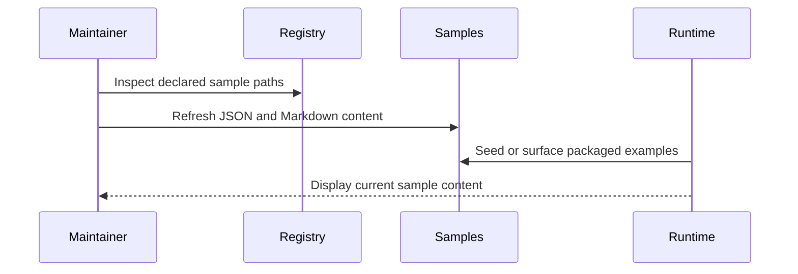

[CodeWiki](../../../../../index.md) / [Artifacts](../../../../index.md) / [pages](../../index.md)

# Detailed Design: Refresh Packaged Spec Builder Sample Assets

## Executive Summary
This sample document shows how a detailed design can describe the implementation approach for updating packaged Spec Builder samples. The design focuses on replacing placeholders with representative JSON and Markdown assets while preserving the canonical filenames declared by the registry.

## Requirements
The packaged sample set must cover all registered artifact types, use current type names, and illustrate the authored structure expected by each corresponding skill. The resulting examples should be internally consistent and easy to inspect without being excessively verbose.

## Detailed Design

### Data Model
JSON samples will model stable identifiers, artifact-specific metadata, and realistic cross-links between roadmap items, epics, stories, test cases, and authored specs. Markdown samples will use front matter plus narrative sections that map to the current artifact-specific skill requirements.

### API Design
No external API changes are required. The packaged examples are passive source assets consumed by existing Spec Builder seeding and rendering workflows.

### Algorithm / Logic
1. Identify the canonical set of sample filenames from the packaged registry.
2. Read the current skill contracts for each artifact type.
3. Write representative JSON content for each sample using current fields and path conventions.
4. Write companion Markdown content with artifact-appropriate sections and breadcrumbs.
5. Keep ids, roadmap references, and doc paths aligned across the sample set.

### Sequence Diagrams

## Error Handling
If a skill contract is ambiguous, the sample should favor currently packaged field names and preserve compatibility with the registry-declared artifact slug. Broken cross-links are avoided by reusing a single coherent sample roadmap hierarchy across the related artifacts.

## Testing Strategy
Validation should confirm that every sample file exists, JSON content is syntactically valid, and linked ids or document paths remain internally consistent. Manual spot checks should verify that the Markdown examples read like realistic authored artifacts rather than placeholders.

## Implementation Plan
Start with the registry-backed file list, refresh the JSON artifacts that define the roadmap hierarchy, then update the authored Markdown samples to mirror those references. Keep the examples concise and deterministic so future maintainers can update them with minimal effort.

## Open Questions
If the packaged skill contracts evolve further, future maintainers should decide whether to keep these examples broadly representative or expand them into stricter schema fixtures validated automatically.
