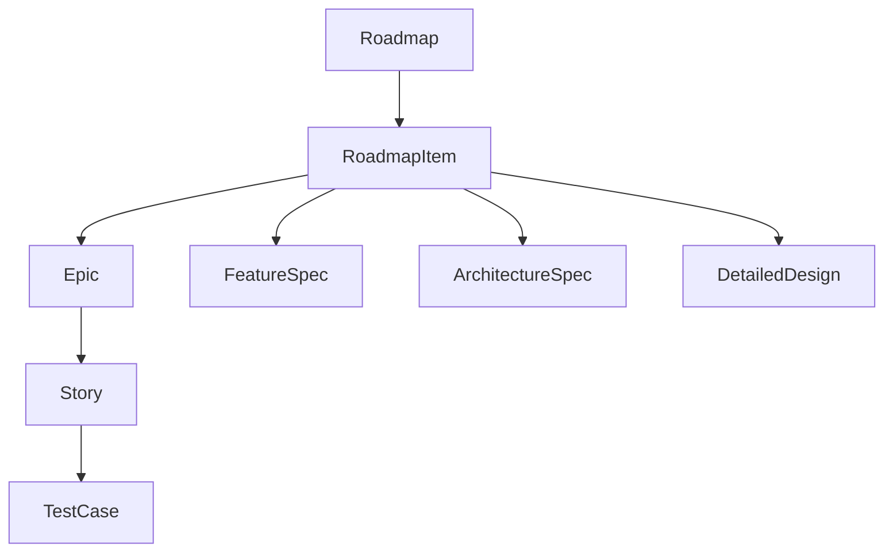

# Impact Analysis: Refresh Packaged Spec Builder Sample Assets

## Change Summary
The packaged Spec Builder samples are being refreshed so they match the current registry, path conventions, and artifact expectations. The change replaces placeholder or stale examples with internally consistent JSON and Markdown samples.

## Affected Artifacts

| Artifact | Type | Impact | Status | Action Required |
|----------|------|--------|--------|-----------------|
| `roadmap.json` | roadmap | medium | stale | update sample roadmap references |
| `roadmap_item.json` | roadmap item | high | stale | align with current required fields |
| `epic.json` | epic | medium | stale | align linked story references |
| `user_story.json` | user story | medium | stale | align parent epic and acceptance criteria |
| `test_case.json` | test case | high | stale | include test_type and roadmap linkage |
| authored spec markdown samples | markdown | high | stale | replace placeholder prose with real structure |

## Dependency Graph

## Detailed Impact
The roadmap hierarchy samples needed the largest updates because other examples depend on their ids and links. The authored spec markdown samples also required substantial changes so they demonstrate front matter, breadcrumbs, and artifact-specific sections.

## Recommendations
Update the sample hierarchy as a coherent set instead of editing files independently. Whenever a skill or registry contract changes in the future, refresh the packaged examples in the same pass to avoid drift.

## Risk Assessment
If packaged samples remain stale, users may treat obsolete examples as authoritative and create invalid artifacts. Refreshing the samples reduces that documentation and onboarding risk significantly.
