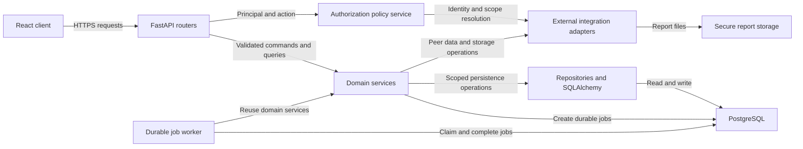

[CodeWiki](../../../../index.md) / [Artifacts](../../../index.md) / [Spec Builder](../index.md)

# EnerSight Analytics Backend Implementation Blueprint

## Scope

This blueprint describes the proposed backend implementation shape for the approved EnerSight Analytics MVP. The backend is a modular FastAPI monolith using SQLAlchemy and PostgreSQL, with a separately runnable durable-job worker sharing the same domain modules and persistence model. It supports authorized CSV ingestion, derived consumption analytics, rolling baselines, anomalies, account-manager alerts and ranking, governed peer benchmarking, and authorized CSV or PDF exports.

This document intentionally does not prescribe endpoint implementation code, external-provider SDKs, migration syntax, or unapproved policy defaults. The identity provider, customer and site master-data source, assignment source, peer-governance rules, final CSV policy, worker/queue technology, report-storage provider, retention policy, and measurable service objectives remain prerequisites where they affect implementation behavior.

## Architecture Explanation

The API process owns HTTP concerns: request validation, authentication integration, authorization decisions, response mapping, correlation context, and conversion of expected domain outcomes into the approved REST contract. Domain services own business orchestration and must not depend on FastAPI request or response objects. Repositories own SQLAlchemy persistence and query construction, while database models own relational mappings and constraints. This separation prevents API routes from becoming an alternative business layer and ensures that worker-driven processing reuses the same domain behavior as request-driven flows.

Authorization is a mandatory boundary around every externally initiated operation. A route resolves an authenticated principal and calls a policy service before loading or mutating a resource. The resulting authorized site, customer, or assigned-portfolio scope is passed to repositories as a query constraint; client-supplied identifiers alone must never determine access. A worker processes only resources already created through an authorized request and remains scoped to the persisted resource rather than acquiring broad read access.

The write path is durable and stateful. Upload and export requests create provenance records and processing jobs, then return observable status rather than claiming completion. The worker claims a job, performs the bounded domain operation, records a terminal outcome, and emits audit and operational events. The analytics read path uses persisted daily consumption and daily analytic facts instead of recalculating results from raw readings for every dashboard request. Policy and calculation versions remain attached to derived facts so historical results, alerts, rankings, and exports are explainable.



## Backend Folder Structure

The following structure is the intended application layout. Paths are proposed because the repository currently contains planning documentation rather than an implemented backend. The `app` package contains all API and worker-shared code; the worker is a separate process entry point rather than a duplicate service implementation.

```text
backend/
  app/
    main.py
    api/
      v1/
        router.py
        routes/
          meter_uploads.py
          sites.py
          account_manager.py
          exports.py
    core/
      config.py
      logging.py
      security.py
      errors.py
      dependencies.py
    domain/
      authorization/
      ingestion/
      analytics/
      alerts/
      ranking/
      benchmark/
      exports/
      jobs/
    models/
      customer.py
      site.py
      user_account.py
      access.py
      meter_upload.py
      meter_reading.py
      daily_consumption.py
      daily_analytic.py
      anomaly_alert.py
      benchmark_snapshot.py
      export_request.py
      processing_job.py
      audit_event.py
    repositories/
      customer_repository.py
      site_repository.py
      access_repository.py
      meter_upload_repository.py
      meter_reading_repository.py
      analytics_repository.py
      alert_repository.py
      benchmark_repository.py
      export_repository.py
      job_repository.py
      audit_repository.py
    schemas/
      common.py
      meter_uploads.py
      consumption.py
      analytics.py
      alerts.py
      rankings.py
      benchmarks.py
      exports.py
    integrations/
      identity.py
      master_data.py
      peer_data.py
      object_storage.py
    db/
      session.py
      base.py
      migrations/
    workers/
      runner.py
      job_handlers.py
    telemetry/
      audit.py
      events.py
  tests/
    unit/
    integration/
```

## Module Responsibilities

### API and Dependency Modules

The `api` package exposes only the approved `/api/v1` transport surface. Route modules parse request data, obtain the authenticated principal through dependencies, request an authorization decision, call one domain service, and map service results to schemas and HTTP responses. They must not embed SQLAlchemy queries, CSV parsing, analytics arithmetic, alert-generation rules, or storage-provider calls.

The `core` package centralizes configuration loading, dependency construction, correlation context, security integration, and exception translation. It is the only location that should know how environment configuration selects concrete external adapters. Application startup must validate required configuration and refuse to start when a production-required integration is absent.

### Authorization and Integration Modules

The authorization domain module normalizes the external authenticated subject into a local `user_account` representation and evaluates actions against active site grants and account-manager assignments. It returns a scoped authorization result, such as an allowed site identifier or a permitted customer portfolio, rather than only a boolean. It must support upload, site-view, alert-view, ranking-view, export-create, export-status, and export-download decisions.

The `integrations` package defines provider-neutral protocols and concrete implementations for identity, customer and site master data, account-manager assignments, peer aggregates, and object storage. Domain services depend on these protocols, not a provider SDK. The adapter layer must return safe, typed failures when a provider is unavailable and must not leak untrusted provider messages to API clients.

### Ingestion and Job Modules

The ingestion service creates immutable upload provenance, validates the selected site authorization, records a checksum and source-file reference, and creates an ingestion job. A job handler validates the CSV and either persists accepted readings and queues downstream analytics work or records a rejected outcome. Until the final policy is approved, unclear duplicate, partial-validity, multi-site, timestamp, timezone, size, and row-limit cases must be rejected or quarantined rather than accepted implicitly.

The jobs module provides durable state transitions, claim behavior, attempt accounting, idempotency keys, retry classification, and terminal outcomes. It coordinates ingestion, analytics, alert creation, and export generation. It must preserve `queued`, `processing`, `completed`, `failed`, and `rejected` states, with transitions recorded atomically with the relevant resource outcome wherever possible.

### Analytics, Alerts, Ranking, Benchmark, and Export Modules

The analytics service aggregates accepted readings into site-local daily consumption. It derives a baseline from the 28 calendar days immediately preceding an evaluated day and excludes that evaluated day. A baseline is nullable when the approved minimum-data rule is not met. For valid non-zero baselines, the service persists deviation and marks an anomaly only when deviation is strictly greater than the configured threshold; the default approved threshold is 20 percent.

The alerts service receives persisted anomalous results and creates an alert only when an active account-manager assignment exists. The ranking service queries only the manager's authorized active portfolio and identifies the active ranking criterion and period in every result. The benchmark service invokes the peer-data adapter only after site authorization and returns an explicit unavailable state when a governed comparison cannot be produced. The export service authorizes a site and date range, creates an export request and job, reads the same scoped derived facts as the dashboard, stores an artifact outside the database, and requires a second authorization decision at download time.

## Router Structure

The version root router composes four resource routers. Each router must use shared authentication, correlation, and exception dependencies and must expose only the routes approved by the architecture. Routes return a consistent error envelope containing a stable machine-readable code, a user-safe message, and optional safe details.

| Router module | Approved routes | Service boundary |
| --- | --- | --- |
| `meter_uploads.py` | `POST /meter-uploads` and `GET /meter-uploads/{upload_id}` | Upload creation and authorized provenance/status retrieval. |
| `sites.py` | `GET /sites/{site_id}/consumption`, `GET /sites/{site_id}/daily-analytics`, and `GET /sites/{site_id}/benchmark` | Authorized site analytics, aggregation, and governed benchmark retrieval. |
| `account_manager.py` | `GET /account-manager/alerts` and `GET /account-manager/customer-ranking` | Assigned-portfolio alert and ranking views. |
| `exports.py` | `POST /exports`, `GET /exports/{export_id}`, and `GET /exports/{export_id}/download` | Authorized export lifecycle and protected file retrieval. |

A router obtains a principal once through a shared dependency, validates path and query values through request schemas, and delegates authorization to the service boundary. An unauthorized request returns the approved safe denial behavior without confirming that a target resource exists. Explicit no-data, unavailable-baseline, and benchmark-unavailable results are successful domain responses, not exceptions.

## Service Layer Structure

Each domain package contains a service façade, value objects for commands and results, policy-aware orchestration, and narrowly scoped collaborator interfaces. Services may coordinate repositories and adapters but must not create circular module dependencies. The dependency direction is `api or worker -> service -> repository or adapter -> database or provider`.

| Service | Responsibilities | Required collaborators |
| --- | --- | --- |
| Authorization service | Resolves principal identity, active grants, assignments, and authorized scopes. | Identity adapter, access repository, user repository. |
| Upload service | Creates provenance and ingestion jobs; returns safe upload status. | Authorization service, upload repository, job repository, audit writer. |
| Ingestion processor | Validates CSV input, persists accepted readings, rejects invalid files, and schedules analytics. | Upload and reading repositories, policy configuration, job repository, audit writer. |
| Analytics service | Builds daily facts, calculates baseline, deviation, anomaly state, and version metadata. | Reading and analytics repositories, site context, calculation policy. |
| Alert service | Creates assignment-constrained anomaly alerts and returns authorized alert lists. | Analytics, assignment, alert, and audit repositories. |
| Ranking service | Produces authorized customer rankings for an approved criterion and period. | Assignment and analytics repositories. |
| Benchmark service | Requests only governed aggregates and maps available or unavailable results. | Authorization service, site repository, peer-data adapter. |
| Export service | Creates and retrieves exports; invokes generation through durable jobs and reauthorizes downloads. | Authorization service, export and analytics repositories, job repository, storage adapter. |
| Job service | Claims, retries, completes, rejects, and fails durable jobs. | Job repository, audit writer, telemetry publisher. |

Services must return typed domain outcomes. Expected outcomes, including empty data, an unavailable baseline, or an unavailable benchmark, are represented as result states. Only violated invariants, unavailable required dependencies, malformed input, and unhandled failures enter the exception path.

## Repository Layer Structure

Repositories are the sole layer that queries or mutates SQLAlchemy models. They accept explicit authorization constraints or resource identifiers already validated by the service layer, and they return domain-oriented records rather than web schemas. A repository must not make authorization decisions, call external integrations, format API errors, or implement analytics policies.

The repository design should use transaction boundaries at the service or unit-of-work level. An upload transition, accepted-reading insertion, and job update must not leave an accepted upload without its required provenance. Similarly, an export completion must not store a download reference until the storage write succeeds.

| Repository | Principal queries and writes |
| --- | --- |
| Access repository | Finds effective site grants and account-manager assignments for a user and time. |
| Upload repository | Creates immutable upload records and retrieves authorized upload status. |
| Reading repository | Inserts accepted readings and retrieves readings by site and time range for processing. |
| Analytics repository | Persists and retrieves versioned daily consumption and analytic facts. |
| Alert repository | Creates eligible alerts and lists alerts constrained to an assigned manager portfolio. |
| Benchmark repository | Optionally records governed benchmark snapshots and their availability state. |
| Export repository | Creates export requests, advances status, and retrieves authorized download metadata. |
| Job repository | Creates, claims, transitions, and records retry metadata for durable jobs. |
| Audit repository | Writes immutable audit evidence that excludes raw meter readings. |

Repository queries must be indexed for site/date range retrieval, active site grants, active customer assignments, manager alert lists, and requester export status. Read models for dashboards should prefer derived daily facts to raw meter readings.

## Database Model Structure

Database models use PostgreSQL foreign keys and SQLAlchemy relationships to preserve provenance and authorization boundaries. Primary identifiers, timestamps, lifecycle state, and policy or calculation version fields should be consistently represented across mutable operational records. The precise column types, index definitions, retention behavior, and supersession strategy remain implementation details to validate against the eventual data-volume and governance decisions.

| Model | Key relationships and invariant |
| --- | --- |
| `customer` | Owns sites and receives account-manager assignments. |
| `site` | Belongs to one customer and identifies business category, timezone, and lifecycle state. |
| `user_account` | Maps a unique external subject to a local role and status. |
| `site_access_grant` | Connects a user to a site for an effective interval. |
| `account_manager_assignment` | Connects a manager to a customer for an effective interval. |
| `meter_upload` | Is immutable provenance for a submitted CSV and tracks validation/processing status. |
| `meter_reading` | Belongs to an upload and a site; only accepted readings participate in analytics. |
| `daily_consumption` | Stores a versioned site-local daily total and coverage state. |
| `daily_analytic` | Evaluates one daily-consumption record with nullable baseline and deviation fields. |
| `anomaly_alert` | References the analytic result, customer, site, assignee, suggested-action version, and lifecycle state. |
| `benchmark_snapshot` | Represents an available governed aggregate or an explicit unavailable outcome. |
| `export_request` | Records requester, site, period, format, status, protected storage reference, and expiry. |
| `processing_job` | Tracks type, related resource, idempotency key, attempts, timestamps, and failure category. |
| `audit_event` | Records actor, action, resource, outcome, correlation identifier, and safe metadata. |

A `daily_analytic` must not classify a day as anomalous when its baseline is unavailable or zero. `anomaly_alert` creation must require a qualifying analytic and an active assignment. `export_request` must not expose its storage reference directly as a public URL. Every derived analytics and alert record should retain calculation and policy version information to avoid unexplained historical changes.

## Schema Structure

The `schemas` package contains Pydantic transport contracts only. Input schemas validate route-level values such as selected site identifiers, date ranges, granularity, ranking criterion, and export format. Output schemas define client-facing resources and explicit state fields. Internal commands and repository records remain domain types, avoiding accidental coupling of persistence shape to public API output.

| Schema module | Public contract responsibility |
| --- | --- |
| `common.py` | Correlation metadata, pagination where approved, and the standard error envelope. |
| `meter_uploads.py` | Upload creation result, validation outcome, and processing status. |
| `consumption.py` | Daily, weekly, and monthly period values with selected range and explicit no-data state. |
| `analytics.py` | Daily actual, baseline, deviation, anomaly flag, and unavailable-baseline state. |
| `alerts.py` | Authorized alert summaries and safe navigation context. |
| `rankings.py` | Assigned-customer ranking rows, criterion, period, and no-data treatment. |
| `benchmarks.py` | Available comparison values or benchmark-unavailable reason codes. |
| `exports.py` | Export creation, lifecycle status, and authorized download availability. |

Schema validation must reject malformed date ranges, unsupported granularity or format values, and request shapes that cannot meet the approved contract. It must not accept or silently normalize ambiguous business-policy behavior. Response schemas must make missing data, unavailable calculations, and processing states explicit.

## Configuration Structure

Configuration is centralized in `core/config.py` and read from environment variables through a typed settings object. Values are grouped by concern so application startup can validate required values without exposing secrets in logs. The browser application must never receive backend secrets, storage credentials, database URLs, or identity-client secrets.

| Configuration group | Purpose |
| --- | --- |
| Application | Environment, API version prefix, feature flag, trusted origins, and safe runtime identity. |
| Database | PostgreSQL connection settings, pool limits, migration configuration, and statement timeouts. |
| Security | Identity issuer/audience settings, token validation configuration, and safe authorization-provider parameters. |
| Processing | Worker enablement, polling or queue configuration, claim duration, retry limit, and backoff policy. |
| Analytics policy | Default anomaly threshold, calculation version, and the approved minimum-data policy reference. |
| CSV policy | Required headers, accepted timestamp rules, size and row limits, duplicate policy, and partial-validity policy. |
| Integrations | Master-data, assignment, peer-data, object-storage, and telemetry adapter selection/configuration. |
| Export policy | Enabled formats, storage namespace, expiry, retention reference, and report policy version. |
| Observability | Log level, structured logging destination, telemetry enablement, and correlation-header behavior. |

No configuration group may substitute a final business or privacy policy that has not been approved. Configuration validation must fail closed for required security integrations and must prevent benchmark or export enablement if their governance or storage prerequisites are incomplete.

## Logging Strategy

The application and worker use structured logs with a consistent event name, timestamp, severity, correlation identifier, process role, job identifier when applicable, safe resource type, outcome, and error category. Request middleware generates or propagates a correlation identifier, and a created durable job persists that identifier so API activity, worker processing, audit evidence, and telemetry can be connected.

Logs must record lifecycle events for upload receipt, validation completion or rejection, job claim and terminal state, analytics calculation completion, anomaly detection, alert creation, benchmark availability, export creation, export completion, and download authorization. Logs should include counts, durations, versions, and safe identifiers where operationally necessary. They must not include CSV contents, raw meter readings, unredacted identity tokens, database URLs, storage credentials, or public download URLs.

Audit events are distinct from diagnostic logs. Audit evidence records security and business-relevant outcomes such as access allowed or denied, uploads, derived calculation completion, alert creation, export request, and export download. Telemetry can measure the product events approved in the feature specification, but it must not create a second unsafe store of raw readings or unnecessary personal data.

## Error Handling Strategy

A centralized exception handler converts recognized errors into the approved error envelope. The envelope contains a stable `code`, a user-safe `message`, an optional safe `details` collection, and the correlation identifier. Internal exception messages, provider responses, stack traces, raw CSV values, and secret-bearing configuration values must never be sent to clients.

| Error category | API behavior | Processing behavior |
| --- | --- | --- |
| Authentication or authorization failure | Return the approved safe denial result without proving inaccessible resource existence. | Stop or avoid work outside the persisted authorized resource scope; record a safe audit outcome. |
| Request validation failure | Return a stable invalid-request code with field-safe details. | Not applicable unless the failed data is a persisted command. |
| CSV validation failure | Return or expose a rejected upload status with correctable, safe validation findings. | Do not persist accepted readings or downstream derived facts. |
| No-data or unavailable calculation | Return a successful typed domain state. | Do not create invalid analytics, alerts, or misleading exports. |
| Benchmark unavailable | Return a successful unavailable state and safe reason code. | Do not infer or calculate a peer value from insufficient data. |
| External dependency failure | Return a safe transient/dependency error where the request cannot proceed. | Apply bounded retry classification, then transition the job to failed with a safe category. |
| Invariant or persistence failure | Return a generic internal error with a correlation identifier. | Roll back the transaction where possible, record failure evidence, and avoid partial success states. |

Jobs must classify failures as retryable, non-retryable, or rejected. Retryable failures use bounded attempts and backoff. Non-retryable failures move to a terminal failed state. Rejected states represent invalid or policy-disallowed work and must not be retried unless a subsequent approved policy change explicitly authorizes reprocessing.

## Unit Testing Strategy

Unit tests isolate services, policy logic, CSV validation, analytics arithmetic, result-state mapping, and job-transition rules from FastAPI, PostgreSQL, and external providers. Tests use fakes or mocks for repositories, adapters, clocks, and configuration. They should assert observable results and collaborator calls rather than implementation details such as private helper methods.

Analytics tests must prove that the baseline uses exactly the 28 preceding calendar days and excludes the evaluated day. They must prove that a 120 kWh actual against a 100 kWh baseline at a 20 percent threshold is not anomalous, while 121 kWh is anomalous. They must also prove that unavailable or zero baselines do not produce an anomaly.

Authorization unit tests must cover role, effective site grant, customer assignment, resource ownership, and safe denial behavior. Ingestion tests must cover required headers, parseable timestamps, numeric kWh values, invalid-file rejection, and the invariant that rejected uploads cannot create accepted readings or downstream jobs. Export and download tests must cover authorization at both creation and retrieval time, explicit no-data behavior, and prevention of unprotected storage references.

Repository and route integration tests are required in addition to unit tests because authorization must constrain real database queries and job state transitions. They should run against a PostgreSQL-compatible test environment and test representative authorized and unauthorized users, different customers, assigned and unassigned managers, no-data periods, unavailable benchmarks, failed jobs, and report status transitions. Provider adapters require contract tests against approved provider behaviors once those providers are selected.

## Prerequisites

The delivery team must resolve the identity and authorization provider, customer-site and account-manager assignment sources, CSV acceptance policy, timezone treatment, baseline minimum-data rule, threshold governance, ranking period and severity definition, peer-cohort governance, report requirements, storage policy, and job execution technology before enabling the affected behavior. The application may establish the proposed module boundaries before all policies are final, but it must fail closed and keep dependent features disabled until their contracts are approved.

A representative non-production dataset is required for tests covering valid and invalid uploads, multiple site timezones, complete and incomplete history, authorization boundaries, peer benchmark eligibility, ranking, and both export formats. Deployment also requires a feature flag, PostgreSQL provisioning, a secure storage integration, and an approved worker execution environment.

## Implementation Steps

1. **Establish the application foundation and integration contracts.** Create the proposed package boundaries, typed configuration, database session boundary, correlation context, provider-neutral adapter protocols, and startup validation. This step creates no externally visible behavior until required security configuration is present.

2. **Implement database models, migrations, and repositories.** Establish the approved entities, foreign keys, lifecycle state representation, query indexes, and repositories. Preserve immutable upload provenance, versioned derived facts, authorized access relationships, durable jobs, and audit evidence.

3. **Implement authorization and durable-job foundations.** Build the policy service, scoped authorization results, adapter-backed identity resolution, job claim/transition behavior, audit writer, and structured event emission. Every later router and worker handler must use these boundaries.

4. **Implement authorized ingestion and analytics processing.** Add upload orchestration, CSV validation, accepted-reading persistence, daily aggregation, versioned baseline/deviation/anomaly calculation, and safe rejected/failed outcomes. This step supports the approved ingestion and analytics stories after CSV policies are confirmed.

5. **Implement authorized read models, alerts, rankings, benchmarks, and exports.** Build service-level query flows and router mappings for approved dashboard, account-manager, benchmark, and export contracts. Add alert creation during analytics completion and protected report generation/download behavior through durable jobs.

6. **Complete verification and controlled rollout readiness.** Execute unit, repository, route, adapter-contract, and worker-flow tests using representative data. Validate structured telemetry and audit evidence, then enable the approved feature flag only after policy, privacy, and operational prerequisites are met.

## Dependencies & Ordering

The foundation and integration contracts precede all other work because authorization, configuration, correlation, and external boundaries are cross-cutting. Database models and repositories precede domain processing because uploads, analytics, jobs, and audit events require durable state. Authorization and jobs must be implemented before ingestion, analytics, exports, and account-manager workflows to ensure that long-running operations retain safe state transitions and access boundaries.

Ingestion and analytics precede alerts, rankings, dashboards, and exports because derived daily facts are their primary data source. Benchmark implementation remains independently gated by approved peer-cohort governance. PDF export remains gated by report-template, retention, and secure-storage decisions. A feature flag gates all user-visible functionality and supports a rollback that stops new processing without deleting source readings or audit evidence.

## Verification Plan

The verification plan maps implementation evidence to the approved behavior. It must be executed with test data representing at least two customers, distinct site grants, an assigned and an unassigned account manager, valid and invalid CSV files, at least 29 days of daily history, no-data periods, and a benchmark-unavailable case.

| Verification area | Expected evidence |
| --- | --- |
| Authorization | Direct route and repository tests demonstrate that customer users cannot retrieve another customer's sites and managers cannot see unassigned customers, alerts, rankings, or exports. |
| Ingestion | Valid input creates a usable site-associated dataset; invalid headers, timestamps, or kWh values result in rejected status and no accepted readings. |
| Analytics | Tests confirm the 28-day preceding window, evaluated-day exclusion, nullable unavailable baseline, and strict greater-than 20 percent anomaly behavior. |
| Read APIs | Consumption, analytics, benchmark, alerts, and ranking results expose explicit no-data or unavailable states rather than zero or server errors. |
| Jobs | Tests prove valid transitions, idempotent retry behavior, bounded retry classification, and terminal `completed`, `failed`, or `rejected` outcomes. |
| Exports | Tests prove authorization on creation and download, status tracking, no-data response, secure storage reference handling, and CSV/PDF behavior once report requirements are approved. |
| Observability | Structured logs, audit events, and telemetry share a correlation identifier and exclude raw readings, tokens, secrets, and unprotected file URLs. |

## Risk Notes

The greatest implementation risk is treating unresolved external contracts or business policies as implicit defaults. The backend must instead encapsulate these concerns behind adapters and typed configuration, keep dependent features disabled, and reject ambiguous input or unavailable governance states safely.

CSV validation, local-time aggregation, duplicate handling, partial-validity handling, and baseline sufficiency materially affect data correctness. These policies must be versioned and explicitly approved before the system classifies a dataset as accepted. Benchmarking must remain unavailable until a peer-data adapter can prove governed aggregate eligibility; it must never derive a peer result from raw or insufficient data.

Long-running operations require operational controls that are not optional. Durable jobs need an idempotency key, safe claim/recovery semantics, bounded retries, and a terminal failure record. Exports create an additional disclosure risk and therefore require secure external storage, expiry/retention policy, and authorization at both request and download time.

## Related Artifacts

This blueprint is grounded in the [approved design summary](../../../../Specs/Other/enersight-approved-design-summary.md), the [MVP architecture specification](../../../../Specs/ArchitectureSpecs/enersight-analytics-mvp-architecture.md), the [core modules detailed design](../../../../Specs/DetailedDesigns/enersight-analytics-core-modules.md), the [architecture decisions](../../../../Specs/Decisions/enersight-analytics-mvp-decisions.md), and the [feature specification](../../../../Specs/FeatureSpecs/commercial-energy-consumption-analytics-anomaly-alerts.md).

The backlog source is the [EnerSight Analytics MVP roadmap item](../roadmap_items/enersight-analytics-mvp.md). Its stories cover authorized ingestion, consumption views, baseline and anomaly behavior, account-manager alerts and ranking, peer benchmarks, and authorized report exports.
