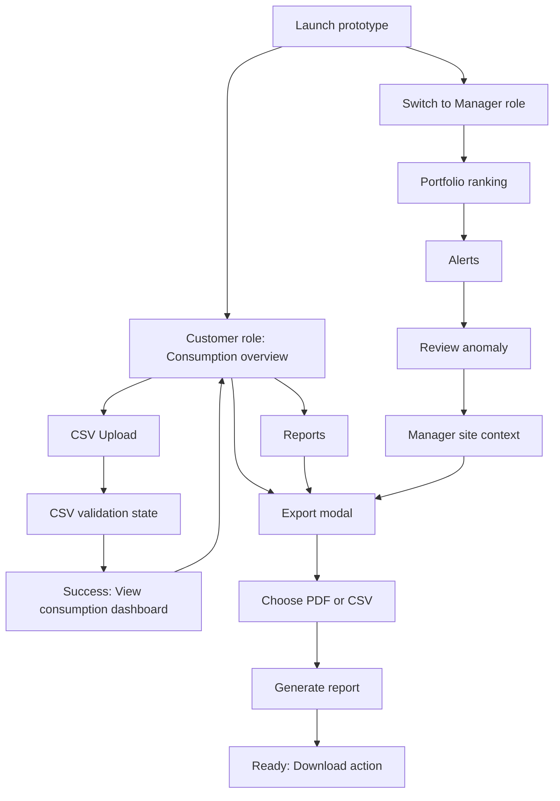

# EnerSight Analytics Prototype Demo Guide

[CodeWiki](../index.md) / [Artifacts](index.md)

## Purpose

This guide supports a stakeholder demonstration of the implemented EnerSight Analytics clickable prototype. The prototype is a frontend-only React application that presents commercial energy-consumption monitoring for a customer and an account manager. All figures, alerts, validation results, and export outcomes are local demonstration data rather than data returned by a backend service.

Rendered screenshots are not included because the prototype could not be launched in the available environment. The screen descriptions and mockup guidance below are derived directly from the implemented interface in `Kavia-test/src/main.jsx` and `Kavia-test/src/styles.css`.

## Demo Scope and Limitation

The application entry point mounts the React application into the `root` element defined by `Kavia-test/index.html`. Its package configuration provides `npm run dev` through Vite and a production `npm run build` command, but no running preview was available for this documentation task.

```html
<div id="root"></div>
<script type="module" src="/src/main.jsx"></script>
```

```json
"scripts": {
  "dev": "vite",
  "build": "vite build"
}
```

The prototype intentionally simulates certain actions. CSV validation changes local UI state after a delay, and report generation changes local modal state after a delay. The prototype itself states that production processing and data-retention policies will be connected in a later phase. Consequently, a stakeholder should treat file ingestion, downloads, reports, alert data, and customer data as demonstration behavior only.

## Screens Included

### Customer Consumption Overview

The default customer view is the Consumption overview dashboard for Harbor Point Market for May 01–28, 2025. It shows four summary metrics: total consumption, daily average, detected anomaly days, and an anonymized peer benchmark. The central chart can switch among Daily, Weekly, and Monthly views. In the Daily view, actual consumption is drawn against a rolling four-week baseline, and anomaly dates are marked on the chart.

The lower part of the screen includes detected-anomaly rows and a peer-benchmark card. The dashboard is designed to explain both the current energy trend and why the highlighted dates warrant attention.

### CSV Upload

The Upload meter data screen presents a staged ingestion experience for the selected Harbor Point Market site. It asks for a CSV file with `timestamp` and `kWh` fields and communicates a CSV-only, 25 MB, one-site-per-file constraint. It has idle, processing, error, and success states.

A non-CSV filename reaches the error state. A filename ending in `.csv` displays a local validation state and then a success state that reports accepted readings, generated daily records, and identified anomalies. It does not inspect or persist the file contents.

### Reports and Export Modal

The Report exports screen presents two sample recent exports and lets the presenter open the Create consumption report modal. The modal identifies the site and date range, provides PDF and CSV options, then simulates report preparation before presenting a download action.

The existing report rows use browser alerts to indicate a demo download. The modal download action closes the modal and displays a temporary success toast. No file is generated or downloaded by the application.

### Account Manager Portfolio

The Customer ranking screen is the account manager landing screen. It shows four assigned customers, ten total detected anomalies, a ranking control, and a table containing customer, site, anomaly count, top deviation, and follow-up status. The ranking can be changed between anomaly count and deviation severity.

Selecting any customer row transitions to the Alerts screen. The displayed customer order is calculated from local data, so the ranking control is interactive even though the portfolio is fixed.

### Account Manager Alerts

The Anomaly alerts screen lists four active anomaly alerts across the manager's assigned portfolio. Each alert shows priority, customer and site, date, actual usage, rolling baseline, deviation, and a suggested follow-up action. Selecting Review anomaly changes the role to Manager, returns to the dashboard, and opens that alert's site-context banner.

### Manager Site Context

The manager site-context experience reuses the consumption dashboard and adds a highlighted context banner. The banner names the selected alert date, its deviation from the rolling baseline, and the customer. It also provides a Prepare report action that opens the report-export modal.

## Navigation Flow

The sidebar changes with the active prototype role. The Customer role provides Consumption, CSV Upload, and Reports. The Manager role provides Portfolio, Alerts, Site context, and Reports. The role switcher resets the user to the customer dashboard or manager portfolio respectively.



The top-right notification button is also interactive. In Customer mode it navigates to Reports, while in Manager mode it navigates to Alerts.

## UI Mockup and Preview Guidance

### Overall Layout

The interface uses a fixed dark navy left sidebar, a white top bar, and a light blue-gray content background. The brand is EnerSight, with a teal “E” mark. The layout is desktop-first, and CSS breakpoints reduce the sidebar to icons below 980 pixels and reorganize content into a single column below 620 pixels.

```text
+--------------------+---------------------------------------------------+
| EnerSight sidebar  | CUSTOMER PORTAL / ACCOUNT MANAGER                |
|                    | Screen title and contextual subtitle             |
| Navigation items   +---------------------------------------------------+
|                    | Filters, site context, and primary action        |
| Role switcher      |                                                   |
| User identity      | Metric cards / portfolio summary                  |
|                    |                                                   |
|                    | Chart, tables, alert cards, upload, or reports   |
+--------------------+---------------------------------------------------+
```

### Visual Language

The customer dashboard uses teal for actual consumption and action buttons, a dashed gray line for the rolling baseline, and coral red for anomalies or elevated usage. The account-manager view uses the same visual language and adds alert-priority indicators and status chips. Panels are white, lightly bordered, and rounded; headings use a heavier display typeface, while supporting labels use a compact sans-serif style.

### Available Preview Information

No screenshot, browser capture, or rendered preview asset was available. The implementation does include responsive styling and SVG chart rendering, so a live demonstration can show the intended layout after the Vite application is started in an environment with dependencies and browser access.

## Sample Data Used

### Customer Site and Reporting Period

The primary customer demonstration context is Harbor Retail Group's Harbor Point Market site. The dashboard's selected date range is May 01–28, 2025. The dashboard displays total consumption of 13,038 kWh, a daily average of 466 kWh/day, two anomaly days, and a peer-benchmark result of 8.6% above average.

### Daily Consumption and Baseline

The prototype stores 28 daily readings in `dailyData`. The actual series rises from 418 kWh on May 01 to 683 kWh on May 26. The rolling baseline rises from 401 kWh to 428 kWh across the same period. May 23 and May 26 are explicitly marked as anomalies.

```javascript
{ label: "May 23", actual: 614, baseline: 423, anomaly: true },
{ label: "May 26", actual: 683, baseline: 426, anomaly: true }
```

The Weekly chart uses values of 2,960, 3,150, 3,320, and 3,608 kWh for weeks W18–W21. The Monthly chart uses 11,210, 11,860, 12,290, and 13,038 kWh for February through May.

### Portfolio and Alerts

The manager portfolio contains four sample customer-site assignments: Harbor Retail Group at Harbor Point Market, NorthStar Hospitality at NorthStar Hotel – West, Crestline Foods at Crestline Distribution, and Mason & Co. Offices at Mason Central. Their sample anomaly counts are 4, 3, 2, and 1 respectively.

The four listed alerts include two High-priority Harbor Retail Group anomalies and two Medium-priority anomalies for NorthStar Hospitality and Crestline Foods. The alert entries also include prewritten suggested actions, such as reviewing HVAC schedules, refrigeration load, cooling runtime, occupancy events, and equipment performance.

### Export Examples

The Reports screen displays two existing sample exports:

| File | Period | Displayed state |
| --- | --- | --- |
| `Harbor_Point_Market_May_2025.pdf` | May 01–28, 2025 | Ready |
| `Harbor_Point_Market_April_2025.csv` | Apr 01–30, 2025 | Ready |

These are display-only records. They should be described as representative report examples during the demo.

## Suggested Stakeholder Journeys

### Journey 1: Customer Identifies Excess Consumption

Begin in the Customer Consumption overview. Point out the total consumption, anomaly count, actual-versus-baseline chart, and the two marked anomaly days. Use the anomaly rows to explain that May 23 is 45% above baseline and May 26 is 60% above baseline. Finish by referencing the peer benchmark, which positions the site at 8.6% above its anonymized retail cohort average.

### Journey 2: Customer Uploads Meter Data

Select CSV Upload from the customer sidebar. Explain the required `timestamp` and `kWh` fields and the local validation nature of the experience. Choose a CSV-named file to show the validating state and subsequent success message, then select View consumption dashboard to return to the dashboard. If appropriate, deliberately select a non-CSV file first to demonstrate the validation error state.

### Journey 3: Customer Produces a Shareable Report

Open Reports, choose Create report, select PDF or CSV, and generate the report. After the simulated preparation state ends, use the ready state to explain that the intended report includes usage, the rolling baseline, and detected anomalies. Select Download to show the confirmation toast, while clearly noting that no actual report file is produced in this prototype.

### Journey 4: Account Manager Prioritizes Follow-Up

Switch the role control to Manager. On the portfolio screen, show the default anomaly-count ranking and toggle to deviation severity. Select a customer row to reach the alert list. Highlight that each alert contains an assigned-customer context, actual and baseline values, priority, and a suggested follow-up action.

### Journey 5: Account Manager Investigates an Alert

From Alerts, select Review anomaly on a high-priority Harbor Point Market alert. The prototype returns to the dashboard in Manager mode, preserves the selected alert, and displays the contextual warning banner. Use Prepare report to transition into the same export flow, framing it as a handoff from anomaly investigation to stakeholder communication.

## Implementation Evidence

The prototype uses role and page state to determine visible navigation and screen content.

```javascript
const [role, setRole] = useState("customer");
const [page, setPage] = useState("dashboard");

const navItems = role === "customer"
  ? [["dashboard", "⌁", "Consumption"], ["upload", "↑", "CSV Upload"], ["reports", "▣", "Reports"]]
  : [["manager", "◫", "Portfolio"], ["alerts", "!", "Alerts"], ["dashboard", "⌁", "Site context"], ["reports", "▣", "Reports"]];
```

The simulated CSV behavior accepts only filenames ending in `.csv` and uses timed state transitions rather than backend processing.

```javascript
if (!file.name.toLowerCase().endsWith(".csv")) {
  setUploadState("error");
  return;
}
setUploadState("processing");
window.setTimeout(() => setUploadState("success"), 1200);
```

The simulated export behavior likewise switches from processing to ready after a short delay.

```javascript
const requestExport = () => {
  setExportState("processing");
  window.setTimeout(() => setExportState("ready"), 1100);
};
```

## Demo Preparation Notes

For a live stakeholder demo, start from the customer dashboard and use the role switcher to make the distinction between customer self-service and manager portfolio oversight clear. Keep the demonstration focused on the prototype's clickable transitions and visual story. Do not represent the CSV validation, data retention, alert calculations, or downloads as integrated production capabilities.

## Source Files

This guide was derived from the implemented prototype entry point, interface logic, visual styles, and package configuration:

- `Kavia-test/index.html`
- `Kavia-test/package.json`
- `Kavia-test/src/main.jsx`
- `Kavia-test/src/styles.css`
