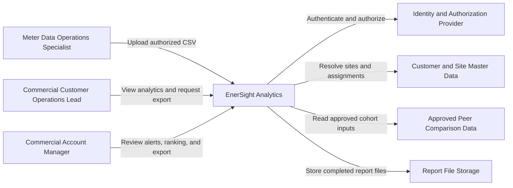
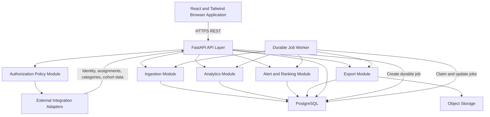
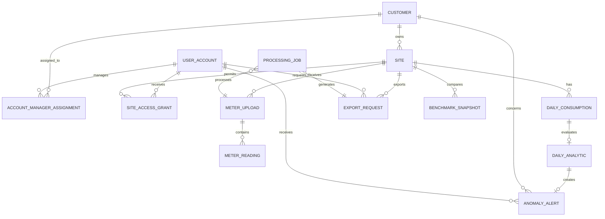
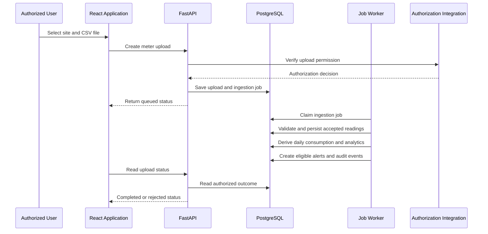

[CodeWiki](../../index.md) / [Specs](../index.md) / [Architecture Specs](index.md)

# EnerSight Analytics MVP Architecture

## Overview

This High Level Design defines the proposed architecture for the approved EnerSight Analytics MVP. The solution accepts authorized CSV meter-reading uploads, derives consumption analytics, rolling four-week baselines and anomalies, presents role-constrained customer and account-manager views, provides anonymized peer benchmarks when eligible data exists, and creates authorized CSV or PDF exports.

The architecture uses React with Tailwind CSS for the browser application, FastAPI for the API and processing boundary, PostgreSQL as the persistent store, SQLAlchemy as the database access layer, and Docker as the deployment packaging model. It is an architecture specification only: it does not prescribe implementation code, an identity provider, a source system for customer assignments, or an unapproved back-office billing integration.

## Context

EnerSight is an analytics layer, not a billing system or a smart-meter control system. Meter Data Operations Specialists submit CSV files for an authorized site. Commercial Customer Operations Leads inspect consumption, baseline, anomaly, benchmark, and export information for sites to which they are authorized. Commercial Account Managers inspect only customers assigned to them, prioritize anomaly activity, open related site context, and prepare reports.

Authentication, organization/site authorization, account-manager assignment, business-category governance, peer cohort eligibility, and suggested-action content remain external decision points. The architecture isolates those concerns behind explicit integration interfaces so that the MVP can use an approved provider without making the provider part of the product domain.

### System Context Diagram

## Decision

The proposed MVP is a modular monolith packaged as Docker services: a React single-page application, a FastAPI API and processing service, PostgreSQL, and a report-file storage integration. FastAPI exposes versioned REST interfaces, applies authorization before every domain operation, and coordinates both request-time reads and durable processing work. PostgreSQL stores the source-of-record metadata, accepted readings, derived analytic facts, alerts, exports, and audit records.

This structure is intentionally simpler than independently deployed microservices. The processing responsibilities are separated into modules and durable job records, allowing them to be moved to dedicated workers later if approved volumes or service-level objectives require it.

### Decision Tradeoffs

| Decision | Rationale | Tradeoffs |
| --- | --- | --- |
| Modular FastAPI backend | Keeps MVP deployment and transactions simple while retaining clear domain boundaries. | A single service can require later extraction if ingestion or exports need independent scaling. |
| PostgreSQL for transactional and analytic facts | Supports relational authorization, integrity constraints, indexed time-series queries, and auditability in one approved platform. | Very large meter volumes may eventually need partitioning, rollups, or an analytical store. |
| Asynchronous durable processing model | Upload parsing, analytics recalculation, and report rendering can outlast a browser request and expose clear progress states. | Requires job-state management and a worker execution mechanism within the Docker deployment. |
| Derived analytic facts persisted by version | Enables explainable alerts, stable exports, and controlled recalculation after configuration changes. | Increases storage and requires explicit supersession rules. |
| Externalized identity and master-data boundaries | Avoids inventing the still-TBD identity, authorization, assignment, and category sources. | MVP delivery depends on contracts with approved external owners. |

## Components

### High Level Design

### Frontend

The React application renders separate role-aware experiences for data operations, commercial customers, and account managers. Tailwind CSS supplies presentation and accessible state styling. The frontend receives only authorized view models from the API and must display explicit loading, processing, no-data, unavailable-baseline, benchmark-unavailable, validation-error, and export-failure states. Chart rendering must identify anomaly points using text, shape, or equivalent accessible cues in addition to color.

### API and Authorization Layer

FastAPI is the public application boundary. It validates request shape, obtains the authenticated principal from the approved identity integration, resolves permitted customer organizations and sites or assigned customers, and applies those constraints before reading or creating any resource. The API must not rely on client-side filtering to enforce access restrictions.

The authorization policy module normalizes external identity and assignment information into a decision such as whether the principal can upload for a site, view a site, view a customer, view an alert, or create an export. It should return denial without exposing inaccessible site, customer, alert, or report data.

### Ingestion Module

The ingestion module creates an immutable upload record, validates the selected site authorization and CSV structure, and schedules parsing. A completed upload becomes an accepted dataset only after required-column, timestamp, and numeric-kWh validation passes under the final approved data-quality rules. Invalid uploads remain recorded for operational traceability but do not contribute readings to analytics.

### Analytics Module

The analytics module derives daily consumption from accepted readings, then calculates daily rolling baselines and anomaly results. A daily baseline uses only the 28 calendar days immediately before the evaluated day. The evaluated day is excluded. The anomaly module calculates deviation percentage as `(actual - baseline) / baseline * 100` and flags an anomaly only when the percentage is strictly greater than the active threshold. With the default 20 percent threshold, an exact 20 percent deviation is not anomalous.

Weekly and monthly charts aggregate accepted daily consumption according to the selected calendar period. The final behavior for incomplete periods, missing readings, and the baseline minimum-data rule remains configurable only after product approval; the architecture records unavailable calculations instead of treating them as zero.

### Alert, Ranking, and Benchmark Module

The alert module creates an alert for each eligible anomaly where an assigned account manager exists. Each alert is linked to the site, anomaly calculation, assignment context, and a versioned suggested-action policy. The ranking module projects authorized assigned customers using either anomaly count or the approved severity measure for an approved ranking period.

The benchmark module reads only governed, anonymized cohort aggregates. It returns a benchmark only when the selected site and period meet approved cohort eligibility and suppression rules. It must never expose identifiable readings or site-level values of peer organizations.

### Export Module

The export module authorizes the requested site and range before scheduling CSV or PDF generation. It uses the same authorized analytic data boundary as the dashboard, persists a durable export request and status, and stores a completed file outside the database. File retrieval requires a second authorization check. Retention, size limits, PDF template, and signed-download policy remain decisions to be finalized.

## Interfaces

### API Contracts

All endpoints are versioned beneath `/api/v1`, use JSON except CSV upload and downloaded files, and require authenticated requests. The exact authentication protocol is delegated to the approved identity provider. Error responses use a stable shape containing a machine-readable `code`, a user-safe `message`, and an optional `details` collection.

| Interface | Method and Path | Authorized Consumer | Request Summary | Response Summary |
| --- | --- | --- | --- | --- |
| Create upload | `POST /meter-uploads` | Authorized data operations user | Multipart CSV and selected `site_id`. | Upload identifier, validation state, and processing status. |
| Read upload | `GET /meter-uploads/{upload_id}` | Upload creator or authorized operational role | None. | Authorized upload provenance, outcome, and safe validation results. |
| Read consumption | `GET /sites/{site_id}/consumption` | Authorized site viewer | Date range and `granularity` of daily, weekly, or monthly. | Period values, data state, and selected range. |
| Read daily analytics | `GET /sites/{site_id}/daily-analytics` | Authorized site viewer | Date range. | Daily actuals, valid baselines, deviations, and anomaly flags. |
| Read benchmark | `GET /sites/{site_id}/benchmark` | Authorized customer site viewer | Comparison period. | Available benchmark result or explicit unavailable state. |
| Read alerts | `GET /account-manager/alerts` | Assigned account manager | Optional customer and date filters. | Alerts only for assigned customers. |
| Read ranking | `GET /account-manager/customer-ranking` | Assigned account manager | Criterion and approved ranking period. | Ordered assigned-customer results and active criterion. |
| Create export | `POST /exports` | Authorized site viewer | Site, date range, and format of CSV or PDF. | Export identifier and queued or completed status. |
| Read export | `GET /exports/{export_id}` | Requester or separately authorized user | None. | Current status and authorized download reference when ready. |
| Download export | `GET /exports/{export_id}/download` | Authorized export viewer | None. | CSV or PDF file stream after authorization. |

### Contract Rules

Upload requests must identify one authorized target site unless a future approved data contract permits multi-site files. Consumption, benchmark, and export requests must reject invalid ranges and return explicit no-data or unavailable states where applicable. A request for an unauthorized resource returns a safe denial response and does not confirm whether the resource exists.

The API should make long-running work observable through durable status values such as `queued`, `processing`, `completed`, `failed`, and `rejected`. A completed response is not returned before ingestion or report generation is actually complete.

## Data Model

### Entity Relationship Diagram

### Database Schema

| Table | Purpose | Key Fields and Constraints |
| --- | --- | --- |
| `customer` | Commercial customer organization. | `id`, external reference, display name, lifecycle status. |
| `site` | Metered customer site and business context. | `id`, `customer_id`, external reference, name, business-category reference, timezone, status. |
| `user_account` | Local representation of an external identity. | `id`, external subject, role, status; external subject is unique. |
| `site_access_grant` | Authorized site access for customer or operational users. | `user_id`, `site_id`, access role, effective interval; unique active grant semantics. |
| `account_manager_assignment` | Customer portfolio membership for account managers. | `user_id`, `customer_id`, effective interval; only approved assignment records are active. |
| `meter_upload` | Immutable file submission and validation provenance. | `id`, `site_id`, uploader, checksum, status, received time, validation summary, source-file reference. |
| `meter_reading` | Accepted timestamped meter readings. | `id`, `upload_id`, `site_id`, observed timestamp, kWh value; uniqueness follows final duplicate policy. |
| `daily_consumption` | Derived daily site consumption. | `site_id`, local consumption date, total kWh, calculation version, source coverage state; unique per site/date/version. |
| `daily_analytic` | Baseline, deviation, and anomaly result for a daily value. | `daily_consumption_id`, baseline kWh nullable, threshold, deviation nullable, anomaly flag, calculation version. |
| `anomaly_alert` | Account-manager alert for an eligible anomaly. | `id`, analytic id, customer, site, assignee, suggested action version, status, created time. |
| `benchmark_snapshot` | Governed anonymized comparison output. | `site_id`, period, cohort policy version, peer average, relative percentage, availability reason. |
| `export_request` | Authorized export request and outcome. | `id`, requester, site, range, format, status, storage reference nullable, expiry time. |
| `processing_job` | Durable asynchronous work. | `id`, job type, related resource type and ID, status, attempts, timestamps, failure category. |
| `audit_event` | Security and operational audit evidence. | actor reference, action, resource reference, outcome, time, correlation identifier; excludes raw readings. |

Foreign keys must preserve customer-site, upload-reading, and daily-consumption relationships. PostgreSQL indexes should support site and date-range retrieval, active access grants, manager assignments, alert lists by assignee and date, and export status by requester. Accepted readings and derived daily data should use a clearly documented retention policy once approved.

## Data Flow

### CSV Ingestion Through Alert Creation

### Dashboard and Export Flow

An authorized user requests site data with a site, date range, and aggregation. FastAPI validates access before querying the derived facts. For daily views, it returns actuals, valid baselines, and anomalies; for weekly and monthly views, it returns aggregate consumption and applicable data-state metadata. A benchmark request is separately evaluated for cohort eligibility. An export request is authorized, persisted, processed through a durable job, and made downloadable only after the requester's access is rechecked.

## Cross-Cutting Concerns

### Security and Privacy

Every API operation must enforce role, customer, site, assignment, and date-range authorization server-side. File objects and generated reports must not become publicly addressable. Audit events should record access decisions, uploads, calculation outcomes, and export lifecycle events without storing raw meter readings or unnecessary personal data.

Peer benchmarking is privacy-sensitive. The benchmark adapter must return only pre-governed, anonymized aggregates and an unavailable result when cohort rules are not met. It must not provide a fallback that exposes an individual peer's consumption.

### Reliability and Data Quality

Validation failures cannot create an accepted dataset. Derived records must identify calculation and policy versions so that changed threshold or data-quality policies can be reconciled without silently overwriting historical meaning. Processing jobs require retry classification, idempotency keys, bounded retry behavior, and observable terminal failure states.

### Observability

The services should emit structured telemetry for upload started, completed, and failed; dashboard viewed; anomaly detected; alert created; ranking changed; benchmark viewed; and export requested, completed, or failed. Correlation identifiers link browser requests, jobs, and audit events. Telemetry excludes raw meter-reading values unless a future approved operational policy explicitly permits them.

### Deployment

Docker packages the React web application and FastAPI service consistently across environments. PostgreSQL runs as a managed service or a separately managed container according to deployment policy. The runtime also needs a secure report-file storage integration and a worker execution process that uses the same application image or an approved worker image. Secrets, database credentials, identity configuration, and external adapter configuration are injected at deployment time and are never embedded in frontend artifacts.

## Alternatives Considered

A microservices-first design was considered but not selected because the MVP has a single bounded product domain, unresolved external contracts, and no approved scale targets. It would introduce service-discovery, distributed-transaction, and observability costs before there is evidence that independent scaling is necessary.

Calculating every dashboard view directly from raw readings was considered but not selected as the primary approach. Persisted daily facts and analytics make baseline, anomaly, alert, export, and ranking outcomes explainable and consistent. Raw readings remain retained as provenance while derived facts serve the read path.

Direct back-office billing-system integration was not selected because it is explicitly outside the approved MVP scope. CSV ingestion is the only approved first-release intake path.

## Migration Strategy

The MVP starts with authorized CSV uploads and therefore requires no mandated source-data migration. Deployment introduces the schema, calculation-policy configuration, external authorization adapters, storage configuration, and feature flag before access is enabled. A controlled pilot should validate representative data quality, baseline calculations, strict threshold behavior, authorization boundaries, benchmark suppression, and both export types.

A rollback disables the feature flag and stops new processing while preserving upload provenance, audit evidence, and source meter readings. It must not delete customer data or modify the external billing source. Any future back-office migration requires a separate approved mapping, reconciliation, backfill, and rollback design.

## Risks and Mitigations

| Risk | Mitigation |
| --- | --- |
| Authorization and assignment systems are not yet identified. | Build explicit adapters and block deployment until a source-of-truth contract and authorization test data are approved. |
| CSV quality, timezone, duplicate, and partial-file policy remain unresolved. | Keep validation policy versioned and do not classify ambiguous uploads as accepted. |
| High meter-reading volume can slow analytics queries. | Index by site and time, retain derived daily facts, and introduce partitioning or worker scaling only after measured volume requirements exist. |
| Benchmark outputs could expose peer information. | Require governed aggregate inputs, minimum-cohort policy, and an explicit unavailable state. |
| Threshold changes can make history difficult to explain. | Persist threshold and calculation versions with every daily analytic and alert. |
| Export generation can outlast a request or expose stale authorization. | Use durable jobs, status polling, secure storage, expiry, and authorization at both request and download time. |

## Architecture Decision Records

### ADR-001: Use a Modular Monolith for the MVP

**Decision.** EnerSight will use one FastAPI application organized into bounded modules for authorization, ingestion, analytics, alerts, benchmarks, exports, and integrations.

**Rationale.** The approved scope is cohesive and requires strong relational consistency between accepted data, calculations, alerts, and authorization checks. A modular monolith minimizes deployment complexity while keeping future extraction boundaries visible.

**Tradeoffs.** Independent scaling and deployment are limited initially. If processing workloads become materially different from API workloads, the job worker or specific modules may need to be separated later.

### ADR-002: Use PostgreSQL for Core Domain and Analytic Facts

**Decision.** PostgreSQL will store authorized domain records, accepted readings, derived daily consumption, analytics, alerts, export lifecycle records, and audit evidence. SQLAlchemy will be the persistence abstraction used by FastAPI modules.

**Rationale.** The approved stack provides transactional integrity, foreign keys, time-based indexing, and reliable joins for access control and explainability.

**Tradeoffs.** PostgreSQL requires active capacity planning for high-frequency readings. A separate analytical store may later be justified, but it is not required for the MVP.

### ADR-003: Persist Derived Daily Analytics With Policy Versions

**Decision.** Daily consumption, baseline, deviation, anomaly status, and alert inputs will be persisted with calculation and policy-version metadata.

**Rationale.** Persisted facts support stable charts, consistent exports and rankings, auditable alert explanations, and controlled recalculation after approved threshold or quality-policy changes.

**Tradeoffs.** This duplicates data derived from readings and requires a clear supersession strategy. It is preferable to unexplained changes caused by recalculating every historical request under current rules.

### ADR-004: Process Uploads and Exports as Durable Jobs

**Decision.** Upload parsing, analytics derivation, alert generation, and report generation will use durable job records with visible lifecycle statuses.

**Rationale.** File and report workloads can be longer than an HTTP request. Durable processing makes retries, outcomes, and progress states reliable.

**Tradeoffs.** The deployment needs a worker process and job-management operational controls. The exact queue implementation is deferred because it is not part of the prescribed stack.

### ADR-005: Enforce Authorization at the API and Data-Query Boundary

**Decision.** FastAPI will resolve authorization before every operation and constrain database queries to authorized customers, sites, assignments, and exports.

**Rationale.** Customer and account-manager boundaries are a core non-functional requirement. Server-side authorization prevents accidental cross-tenant exposure through frontend defects or direct API use.

**Tradeoffs.** Every endpoint and asynchronous job must carry enough authorization context for safe decisions. External assignment data availability becomes a delivery dependency.

### ADR-006: Treat Peer Benchmarking as a Governed Aggregate Integration

**Decision.** Peer comparison will consume only approved anonymized aggregate data through an adapter and will return a benchmark-unavailable state when eligibility cannot be established.

**Rationale.** The product requires useful comparison without disclosing another customer's or site's consumption.

**Tradeoffs.** Benchmark availability may be lower than users expect until governance, category, cohort size, and period rules are approved. This is preferable to inferring comparisons from insufficient data.

## Related

This specification implements the approved architecture direction for the [Commercial Energy Consumption Analytics and Anomaly Alerts](../FeatureSpecs/commercial-energy-consumption-analytics-anomaly-alerts.md) feature specification and the [EnerSight Analytics MVP roadmap item](../../Artifacts/SpecBuilder/pages/roadmap_items/enersight-analytics-mvp.md). The companion [EnerSight Analytics Core Modules Low Level Design](../DetailedDesigns/enersight-analytics-core-modules.md) elaborates the core module boundaries without adding implementation code.
