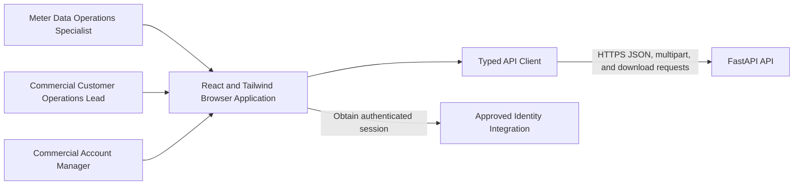
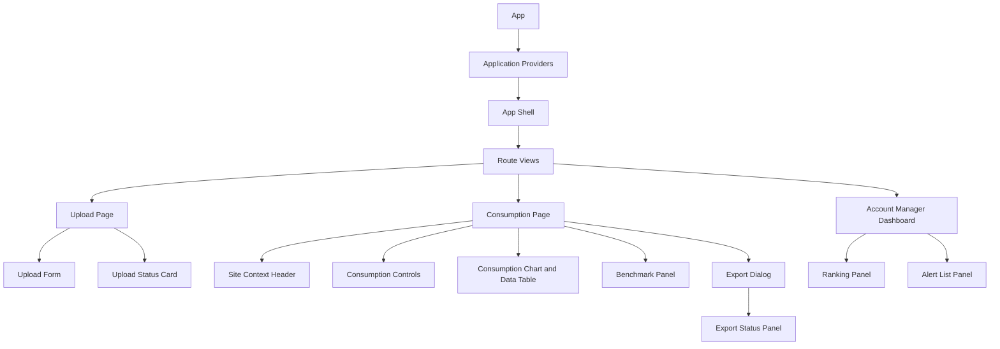

[CodeWiki](../../index.md) / [Specs](../index.md) / [Architecture Specs](index.md)

# EnerSight Stage 6 Frontend Architecture

## Purpose and Scope

This architecture defines the proposed Stage 6 browser implementation for the approved EnerSight Analytics MVP. It translates the approved personas, journeys, product backlog, architecture, API contracts, and currently available backend implementation into a React and Tailwind CSS frontend design. It covers the three approved role-aware experiences: meter-data operations upload, commercial customer consumption analysis, and commercial account-manager anomaly follow-up.

The browser application is a presentation and interaction layer. It must not calculate authoritative consumption, baselines, anomalies, rankings, access permissions, or export authorization. It renders API-supplied, authorization-scoped view models and clearly represents normal domain states such as no data, unavailable baseline, unavailable benchmark, upload processing, and export processing. It must never compensate for an incomplete API by locally exposing unverified or unscoped data.

This specification is forward-looking. The existing backend source in `backend/app/` provides a concrete implementation reference, but the Stage 5 API matrix has not produced execution evidence. The frontend may proceed with independently testable UI structure, state components, contract adapters, fixtures, and accessibility work. Only the integration work that requires verified runtime behavior is blocked, as identified in [Stage 5 Dependency Assessment](#stage-5-dependency-assessment).

## Architectural Principles

The application should be organized by user-facing feature rather than by generic technical type alone. Each feature owns its route-level screen, presentational components, hooks, API adapter functions, input validation, and state-specific rendering. Shared components are limited to reusable application shell, accessibility, feedback, form, chart, and export primitives.

The API client is the sole browser boundary to FastAPI. It must attach the approved authentication context through the production identity integration, attach a generated or inherited `X-Correlation-ID`, parse the documented safe error envelope, and preserve the API response state instead of flattening it into a generic failure. No component may directly construct fetch calls to `/api/v1` or infer authorization from data returned by a prior request.

The browser must treat server authorization as authoritative. Client-side role-aware routing and conditional controls improve usability but are not access control. A 401, 404-safe denial, 422 validation error, 503 feature-disabled response, or other safe API result must be rendered without revealing hidden identifiers, prior response data, internal diagnostics, or any resource relationship that the backend does not return.

## Frontend Context



The frontend serves three role-oriented paths. The operations path supports an authorized site selection and CSV upload lifecycle. The customer path supports consumption review, daily analytics, peer benchmark results, and report exports for authorized sites. The account-manager path supports assigned-customer ranking, assigned anomaly alerts, navigation to an authorized site context, and exports. The API, not the frontend, validates a site's accessibility and the manager's assignment portfolio.

## React Project Structure

The following project structure is proposed for the Stage 6 application. It is a design target, not evidence that the directories already exist.

```text
frontend/
  src/
    app/
      App.tsx
      providers.tsx
      router.tsx
      routes.ts
    api/
      client.ts
      errors.ts
      contracts.ts
      meterUploads.ts
      sites.ts
      accountManager.ts
      exports.ts
    auth/
      AuthProvider.tsx
      useAuth.ts
      roleGuards.tsx
    components/
      layout/
        AppShell.tsx
        Header.tsx
        Navigation.tsx
        PageHeader.tsx
      feedback/
        ErrorState.tsx
        EmptyState.tsx
        FeatureDisabledState.tsx
        InlineAlert.tsx
        LoadingIndicator.tsx
        ProcessingStatus.tsx
      forms/
        DateRangeField.tsx
        SelectField.tsx
        ValidationSummary.tsx
      charts/
        ConsumptionChart.tsx
        ChartLegend.tsx
        ChartDataTable.tsx
      exports/
        ExportDialog.tsx
        ExportStatusPanel.tsx
      accessibility/
        LiveRegion.tsx
        VisuallyHidden.tsx
    features/
      uploads/
        UploadPage.tsx
        UploadForm.tsx
        UploadStatusCard.tsx
        uploadValidation.ts
        useUpload.ts
        useUploadStatus.ts
      consumption/
        ConsumptionPage.tsx
        SiteContextHeader.tsx
        ConsumptionControls.tsx
        ConsumptionPanel.tsx
        DailyAnalyticsPanel.tsx
        BenchmarkPanel.tsx
        consumptionSelectors.ts
        useConsumption.ts
        useDailyAnalytics.ts
        useBenchmark.ts
      accountManager/
        AccountManagerDashboardPage.tsx
        RankingPanel.tsx
        AlertListPanel.tsx
        AlertRow.tsx
        rankingControls.ts
        useAlerts.ts
        useRanking.ts
      exports/
        useCreateExport.ts
        useExportStatus.ts
        exportPolling.ts
    hooks/
      useCorrelationId.ts
      useDocumentTitle.ts
      useMediaQuery.ts
    state/
      queryClient.ts
      uiStore.ts
      selectionStore.ts
    styles/
      index.css
      tokens.css
    test/
      fixtures/
      handlers/
      renderWithProviders.tsx
```

The `app` directory owns global providers, routes, and startup composition. The `api` directory owns typed transport integration, response parsing, safe error normalization, request headers, and download handling. Feature directories own user workflows and may import shared primitives, but features should not import another feature's internal hooks or components directly. Shared UI components must remain domain-neutral unless they are an explicitly shared EnerSight concept such as the consumption chart or export status panel.

## Route and Screen Model

The route model establishes navigable context without duplicating server-owned authorization state. Route parameters identify a selected site, customer, alert, upload, or export only when the current user has reached the route through the approved interface. The destination screen always performs its own authorized API request and must show a safe unavailable state if access is denied.

| Route | Screen | Intended user | Primary server data | Primary outcome |
| --- | --- | --- | --- | --- |
| `/uploads` | Meter upload page | Meter Data Operations Specialist | Upload creation and upload status | An authorized CSV becomes queued, processing, completed, rejected, or failed. |
| `/uploads/:uploadId` | Upload outcome view | Upload creator or authorized operations user | Upload status | The user sees only safe provenance and validation findings for an authorized upload. |
| `/sites/:siteId/consumption` | Site consumption page | Authorized customer user or account manager | Consumption, daily analytics, benchmark, export status | The user understands consumption, baseline, anomaly, benchmark, and export availability for one authorized site. |
| `/account-manager` | Account-manager dashboard | Commercial Account Manager | Customer ranking and alert list | The manager prioritizes only assigned customers and opens an alert. |
| `/account-manager/alerts/:alertId` | Alert resolution route | Commercial Account Manager | Client-selected alert context followed by site requests | The manager is redirected to the authorized site context; no alert-detail endpoint is assumed. |
| `/exports/:exportId` | Export outcome view or panel route | Authorized requester or site viewer | Export lifecycle status | The user can monitor the request and download only an API-confirmed available file. |

The account-manager API currently exposes a list of alerts but no dedicated alert-detail endpoint. The frontend should preserve the selected alert's `site_id`, `customer_id`, and anomaly date in navigation state only as a convenience for route context. The destination site page must request consumption and analytics again using its `site_id`; it must not treat navigation state as data authorization or as a replacement for a backend alert lookup.

## Screen-to-Component Mapping

| Screen | Feature components | Shared components | Data dependencies | Required domain states |
| --- | --- | --- | --- | --- |
| Meter upload | `UploadPage`, `UploadForm`, `UploadStatusCard` | `PageHeader`, `SelectField`, `ValidationSummary`, `ProcessingStatus`, `ErrorState` | Create upload; read upload status | Idle, client-invalid, submitting, queued, processing, completed, rejected, failed, unauthorized, feature-disabled. |
| Authorized upload outcome | `UploadStatusCard` | `PageHeader`, `ProcessingStatus`, `ValidationSummary`, `ErrorState` | Read upload status | Queued, processing, completed, rejected, failed, unavailable. |
| Site consumption | `ConsumptionPage`, `SiteContextHeader`, `ConsumptionControls`, `ConsumptionPanel`, `DailyAnalyticsPanel`, `BenchmarkPanel` | `ConsumptionChart`, `ChartLegend`, `ChartDataTable`, `DateRangeField`, `LoadingIndicator`, `EmptyState`, `ErrorState` | Consumption; daily analytics; benchmark | Loading, available, no data, baseline unavailable by day, benchmark unavailable, invalid range, unavailable, feature-disabled. |
| Export request and outcome | `ExportDialog`, `ExportStatusPanel` | `DateRangeField`, `SelectField`, `ProcessingStatus`, `InlineAlert`, `ErrorState` | Create export; read export status; download export | Idle, client-invalid, queued, processing, completed-downloadable, rejected, failed, no exportable data if supplied, unavailable. |
| Account-manager dashboard | `AccountManagerDashboardPage`, `RankingPanel`, `AlertListPanel`, `AlertRow` | `PageHeader`, `DateRangeField`, `SelectField`, `LoadingIndicator`, `EmptyState`, `ErrorState` | Customer ranking; alert list | Loading, ranking available, ranking no data, alerts available, alerts no data, invalid range or criterion, unavailable, feature-disabled. |

The consumption page may render both aggregated consumption and daily analytics. When the selected granularity is daily, the chart should use the daily analytics payload as the source for actual values, valid baseline values, and anomaly indicators, because that contract carries the per-day baseline and anomaly state. The consumption endpoint remains useful for its selected aggregation response and for weekly and monthly views. The frontend should not attempt to aggregate raw data locally or reconstruct a daily baseline from weekly or monthly data.

## Component Hierarchy



The application shell owns navigation, account context, global error boundary behavior, a live region, and responsive layout. Route views own query coordination and route-level state. Feature panels receive typed props and emit user intentions through callbacks. Chart and form primitives remain controlled components so that state changes can be reflected in the URL, the feature selection store, and API queries consistently.

## API Integration Mapping

All browser requests use the backend prefix configured for the deployed environment, currently `/api/v1` in the inspected backend. The client sends `X-Correlation-ID` for all mutation and read requests and treats an `X-Correlation-ID` returned by the API as the correlation reference to display only in support-oriented error detail. Production authentication should use the approved identity integration. The inspected backend currently expects `X-External-Subject`, which is suitable only as a development-contract detail and must not be treated as a client-side authorization mechanism.

| Frontend capability | API method and path | Request model | Response model used by UI | Frontend behavior |
| --- | --- | --- | --- | --- |
| Submit CSV upload | `POST /meter-uploads?site_id={siteId}` | Multipart form field `file`; selected site query parameter | `UploadResponse` | Disable duplicate submission while pending, then show queued status and begin bounded status polling. |
| Read upload lifecycle | `GET /meter-uploads/{uploadId}` | Path identifier | `UploadResponse` | Render processing, completed, rejected validation summary, or failed outcome. Poll only while queued or processing. |
| Read consumption | `GET /sites/{siteId}/consumption` | `from_date`, `to_date`, `granularity` query parameters | `ConsumptionResponse` | Render period values for daily, weekly, or monthly mode and preserve `available` versus `no_data`. |
| Read daily analytics | `GET /sites/{siteId}/daily-analytics` | `from_date`, `to_date` query parameters | `DailyAnalyticsResponse` | Render actuals, valid baselines, deviations, threshold, and accessible anomaly markers. |
| Read benchmark | `GET /sites/{siteId}/benchmark` | Path identifier | `BenchmarkResponse` | Render available aggregate information or an explicit safe unavailable reason; never invent a peer comparison. |
| Read manager alerts | `GET /account-manager/alerts` | None | `AlertsResponse` | Render only the list received; use `site_id` to navigate to the site page. |
| Read customer ranking | `GET /account-manager/customer-ranking` | `from_date`, `to_date`, `criterion` query parameters | `RankingResponse` | Render server order, criterion, period, and explicit no-data outcome. |
| Create export | `POST /exports` | JSON `site_id`, `from_date`, `to_date`, `output_format` | `ExportResponse` | Show queued or processing state and begin bounded lifecycle polling. |
| Read export lifecycle | `GET /exports/{exportId}` | Path identifier | `ExportResponse` | Render status and enable download only when `download_available` is true. |
| Download export | `GET /exports/{exportId}/download` | Path identifier | File stream | Initiate browser download only after a direct authorized request succeeds; never cache or synthesize a file URL. |

### Contract Discrepancies Requiring Explicit Feature Handling

The approved product scope includes ranking by anomaly count or deviation severity, alert content including customer name, site, date, deviation, and suggested action, and both CSV and PDF exports. The inspected backend contract currently exposes only `anomaly_count` as a `RankingCriterion`; ranking rows contain `customer_id`, anomaly count, and rank; alert responses contain identifiers, anomaly date, deviation, and status but not customer name, site display name, or suggested action; and the worker rejects PDF exports with `pdf_storage_not_configured`, while download supports completed CSV only.

The frontend must not fabricate these missing values. It should provide only controls that the verified API supports. Until a verified contract exposes deviation-severity ranking, a customer-name/display mapping, suggested actions, and completed PDF capability, the Stage 6 UI should either hide the unsupported control or present an explicitly unavailable capability that does not imply implementation readiness. This is a contract-completion dependency, distinct from the lack of Stage 5 execution evidence.

## API Client and Query Behavior

The typed API client should normalize response and error behavior into a small number of stable frontend results. Successful responses remain typed by endpoint. A safe error response is parsed as `code`, `message`, optional `details`, and `correlation_id`. Network failures, parsing failures, and unexpected content are mapped to a generic retriable technical state without exposing browser or provider diagnostics to the user.

A query cache is appropriate for read-only consumption, analytics, benchmark, alerts, ranking, upload-status, and export-status requests. Query keys must include each scope-defining value: route resource identifier, selected date range, granularity, ranking criterion, and authenticated-session identity. Queries must be invalidated after successful upload completion and after export creation as appropriate. Cached data may remain visible as an explicitly labeled previous result while a changed selection reloads, but stale data must not be shown as the current selection's result.

Status polling applies only to a specific upload or export created or retrieved by the current route. It should continue only for `queued` and `processing`, stop on `completed`, `rejected`, or `failed`, stop on authorization or feature-disabled responses, and have a bounded retry policy that transitions to a user-visible “status could not be refreshed” state. Polling does not replace server-side job recovery or proof of job correctness.

## State Management Strategy

The frontend has four distinct state categories. Keeping them separate avoids mixing durable server facts with transient UI controls or identity claims.

| State category | Owner | Examples | Rules |
| --- | --- | --- | --- |
| Server state | Typed API client and query cache | Consumption periods, daily analytics, benchmark response, rankings, alerts, upload lifecycle, export lifecycle | The API response is authoritative. Cache keys must include all request parameters and active session scope. |
| URL state | Router | `siteId`, `uploadId`, `exportId`, date range, granularity, selected ranking criterion | Use for shareable, recoverable screen context. Validate syntax before making requests. |
| Feature UI state | Feature-local hooks or small UI store | Open export dialog, selected alert row, submitted file name, polling visibility, disclosure expansion | Keep local unless another route needs it. Do not store server resources as mutable copies. |
| Authentication/session state | Approved identity provider adapter | Authenticated subject, coarse role claims, session renewal state | Treat as navigation and presentation context only; server authorization remains authoritative. |

A lightweight local UI store may preserve user preferences such as reduced-motion selection, collapsed panels, and the most recent valid screen controls. It must not persist upload file contents, report contents, sensitive response bodies, access tokens, raw CSV, internal IDs unrelated to the active route, or authorization decisions.

The initial implementation may use React context and a query library for server state rather than a global client-state library. A global store should be added only if a concrete cross-feature interaction cannot be expressed through typed query state, route state, or controlled component props.

## Form Validation Rules

The frontend applies client-side validation to improve feedback and reduce avoidable requests. It is not the source of truth. Every field remains subject to FastAPI validation and server authorization, and API validation errors replace or supplement the client message using field-safe `details`.

| Form or control | Client-side rule | Server-authoritative behavior | UI response |
| --- | --- | --- | --- |
| Upload site selection | A non-empty selected site identifier is required before submission. | Server verifies operations role and site access. | Show inline required-field validation; handle safe denial without disclosing site information. |
| Upload file | A file is required and filename must end in `.csv`. Do not inspect or persist raw file content beyond request submission. | Server requires non-empty CSV and validates supported headers, timezone-aware timestamps, numeric non-negative kWh, and row content during processing. | Reject missing/non-CSV selection locally; render returned validation summary after lifecycle update. |
| Consumption date range | Both dates are required and `from_date` must be on or before `to_date`. | API validates dates and allowed query shape. | Disable apply action until valid; map 422 field details to controls. |
| Consumption granularity | Only `daily`, `weekly`, or `monthly` may be selected. | API validates enumeration. | Render as a segmented control or select with only supported values. |
| Ranking date range | Both dates are required and ordered. | API validates dates and manager scope. | Preserve the last valid selection while new data loads. |
| Ranking criterion | Expose only verified supported API values. The inspected backend supports `anomaly_count` only. | API rejects unsupported criterion. | Do not expose severity ranking as functioning until a verified contract supports it. |
| Export site and range | Site identifier, ordered inclusive dates, and format are required. | API reauthorizes site access and validates request model. | Retain selected values after recoverable errors; never expose unauthorized export metadata. |
| Export format | Expose CSV. PDF may be displayed as unavailable only if product needs the capability visible before backend enablement. | The inspected backend accepts PDF creation but rejects it asynchronously because protected storage is not configured. | Prefer disabling PDF with an explanatory unavailable message until contract and Stage 5 verification evidence support enablement. |

The product specification leaves CSV size, row limits, duplicate treatment, partial-validity treatment, dashboard default range, and many policy decisions open. The frontend must avoid presenting invented limits or irreversible client-side behavior for those unresolved policies. It may show the API’s safe validation outcome and link to approved guidance when one exists.

## Loading States

Loading states must preserve context and make the type of in-progress work clear. Skeleton content is suitable for cards, tables, and charts when layout is known. A spinner alone is insufficient for long-lived upload or export processing because it does not communicate durable status.

| Context | Loading behavior |
| --- | --- |
| Initial route load | Render a page-level loading region with the selected route context and accessible status text. |
| Changed range, granularity, or criterion | Keep controls visible, indicate that results are refreshing, and visually distinguish any retained prior result from the pending selection. |
| Upload submit | Disable repeated submission, retain selected site and safe filename, announce upload submission, and show returned queued or processing status. |
| Upload status polling | Display a durable `queued` or `processing` state with a refresh indicator, not a claim that the dataset is ready. |
| Chart data | Reserve the chart region and its data-table alternative; do not show a zero-line placeholder as though it is data. |
| Benchmark request | Render the benchmark card as loading independently so consumption remains usable if the benchmark response is slow. |
| Export creation and polling | Preserve selected site, range, and format; display queued or processing state and prevent repeated creation of the same request while status is unresolved. |
| File download | Disable the download control during the direct request and announce either download start or a safe failure message. |

Every loading indicator must expose an accessible label through visible text or an ARIA live region. Motion must respect user reduced-motion preferences.

## Error States

The frontend must classify and render errors without exposing protected data. A safe resource-unavailable response is intentionally ambiguous and must remain ambiguous in the UI. The browser should retain safe user-entered selections where retry is meaningful, but it must clear any stale server result when the requested resource, session, or route scope changes.

| API or browser condition | User-facing state | Retry behavior |
| --- | --- | --- |
| `401 authentication_required` | Authentication is required to continue. | Start the approved sign-in or session-renewal flow; do not retry automatically in a loop. |
| `404 resource_unavailable` | The requested item is unavailable. | Provide a safe route back to the relevant dashboard or list; do not state whether it existed or was unauthorized. |
| `422 invalid_request` or `invalid_upload` | One or more values need correction. | Highlight field-safe details and allow resubmission after correction. |
| `503 feature_disabled` | EnerSight is temporarily unavailable. | Do not poll or resubmit automatically; provide a non-sensitive retry action later. |
| `409 export_not_ready` | The requested export is not available for download yet. | Continue lifecycle refresh only if status remains queued or processing; otherwise offer a safe return path. |
| Network failure or timeout | The request could not be completed. | Offer a deliberate retry and preserve only safe selections. |
| `500 internal_error` or malformed response | The service could not complete the request. | Offer retry and show correlation identifier when returned for support purposes. |
| Download failure | The export could not be downloaded. | Recheck export status before offering another download attempt. |

An error component must use the API-provided user-safe message when present and must not expose raw fetch exceptions, stack traces, response bodies, internal storage details, tokens, or database diagnostics. The correlation identifier may be displayed or copied only as a support reference.

## Empty and Unavailable States

An empty state represents a successful domain response that has no relevant records. An unavailable state represents a known constraint, such as no valid baseline or no governed benchmark. Neither is equivalent to a technical error.

| Screen area | Trigger | Required message intent and action |
| --- | --- | --- |
| Consumption chart | `state: "no_data"` | State that no accepted consumption data exists for the selected authorized site and date range. Do not render zero values. Allow the user to revise the range or site. |
| Daily analytics | Overall `no_data` | Explain that daily analytics cannot be shown because there are no accepted values in the selected range. |
| Baseline overlay | A day has `state: "baseline_unavailable"` | Keep actual daily consumption visible where supplied and mark the baseline as unavailable for that date. Do not plot baseline as zero or create anomaly decoration. |
| Benchmark | `state: "unavailable"` | State that a peer comparison is unavailable. Show only the safe reason code or a mapped plain-language equivalent; do not infer peer data. |
| Manager ranking | `state: "no_data"` | Explain that no assigned customers have ranking data for the selected period. Do not suggest that unassigned customers can be viewed. |
| Manager alerts | `state: "no_data"` | Explain that there are no anomaly alerts in the manager's authorized portfolio. |
| Upload status | `rejected` | Explain that the CSV was not accepted and show only the safe validation summary returned by the API. |
| Export capability | PDF is currently fail-closed | Explain that PDF export is not available in the current environment. Do not present a download button or imply that report generation will complete. |
| Export lifecycle | Rejected or failed | Explain that the export was not completed, using the safe failure category when returned. Do not show a file link. |

## Responsive Design Strategy

The product must remain usable on narrow screens without making charts, tables, upload controls, ranking, alert context, or export actions inaccessible. The layout should be content-led rather than tied to a device taxonomy.

On wide screens, the application shell presents persistent primary navigation, a content-width constraint, and a two-column analytical layout where consumption visuals occupy the primary column and benchmark/export context occupies a secondary column. Ranking and alert areas may share a dashboard grid while preserving keyboard order and clear headings.

At medium widths, navigation collapses into an accessible menu, dashboard panels stack when their readability would otherwise suffer, and tables retain horizontal scroll only when their essential columns cannot be reformatted safely. At narrow widths, date controls become vertically stacked, segmented controls wrap or become a select element, action buttons become full-width where helpful, and charts preserve an accessible tabular alternative. Touch targets must be large enough for reliable interaction, and non-color anomaly markers must remain visible at all breakpoints.

The responsive implementation should use Tailwind breakpoints only as layout thresholds, not as conditional data behavior. Data availability, authorization, errors, and domain states must be identical regardless of screen width. CSS should honor system reduced-motion and contrast preferences. The visual design must use a text label, marker shape, pattern, annotation, or data table in addition to color for anomaly identification.

## Accessibility and Interaction Requirements

The approved feature requires anomaly states to be distinguishable without color alone. The consumption chart must therefore provide a visible legend, a marker or annotation for anomalous days, tooltip content that includes date, actual consumption, baseline availability, deviation, threshold, and anomaly status, and a semantically equivalent data table. A baseline-unavailable day must be described as unavailable rather than reported as a numeric zero.

All forms require persistent labels, programmatic association of validation messages, keyboard operation, error-summary focus after submission failure where appropriate, and live announcements for upload and export state transitions. Dialogs, including export confirmation, must manage focus, support Escape when cancellation is safe, and restore focus to the initiating control when closed. Navigation from a manager alert to site context must set a meaningful document title and page heading.

## Stage 5 Dependency Assessment

The Stage 5 API execution evidence records that API-001 through API-033 were blocked before test discovery and no HTTP requests, application startup, migration run, database interaction, response-contract assertion, authorization-negative assertion, worker-concurrency scenario, retry scenario, recovery scenario, or export verification executed. That lack of evidence does not prevent all Stage 6 work, but it blocks frontend claims and integration behavior that depend on verified runtime contracts.

| Frontend work item | Stage 6 status | Relationship to incomplete Stage 5 verification |
| --- | --- | --- |
| React project skeleton, routing, shared layout, Tailwind tokens, component library, responsive CSS, and accessibility primitives | Not blocked | These are browser-internal activities that can be implemented and unit-tested without a runnable backend. |
| Screen components, role-aware navigation, fixtures, mock service handlers, form controls, client validation, empty states, loading states, and error-state components | Not blocked | These can be designed and tested against the documented schemas and safe error envelope, provided they are labeled as contract-based rather than live integration proof. |
| Typed API adapters and serialization based on inspected `schemas.py` | Not blocked for implementation; blocked for production acceptance | The source contract exists, but Stage 5 has not verified actual status codes, headers, CORS behavior, response shapes, failure envelopes, or lifecycle results in a runnable environment. |
| Live endpoint integration, end-to-end journeys, browser-to-API authentication, and CORS validation | Blocked | Stage 5 has no API execution evidence. The current backend reads `X-External-Subject` and configured CORS origins, but their deployment-ready behavior cannot be accepted without a runnable verified environment. |
| Upload lifecycle polling and rendering of returned validation outcomes | Blocked for verified integration | The UI can be built with fixtures, but no Stage 5 evidence confirms upload HTTP behavior, durable worker processing, status transitions, response contracts, or destructive-flow safety. |
| Consumption, daily analytics, no-data, and baseline-unavailable live rendering | Blocked for verified integration | API execution has not confirmed aggregation output, range validation, baseline availability, strict threshold behavior, or authorization-negative behavior. |
| Account-manager alerts and ranking live rendering | Blocked for verified integration | No API verification confirms authorized portfolio isolation, empty states, ordering, or response contracts. In addition, the currently inspected implementation lacks severity ranking and the richer alert display fields required by the approved product. |
| Benchmark live rendering | Blocked | Stage 5 has no response evidence, and the inspected implementation intentionally returns `unavailable` because peer governance is not configured. The frontend may implement the unavailable state but must not claim an available benchmark path works. |
| CSV export creation, lifecycle polling, and download integration | Blocked for verified integration | The browser UI can be created, but Stage 5 has not verified lifecycle status, download reauthorization, response headers, expiry, or storage safety. |
| PDF export availability and download | Blocked by implementation and verification | The inspected worker rejects PDF exports with `pdf_storage_not_configured`, and Stage 5 has no execution evidence. The frontend must keep PDF unavailable until protected storage, template behavior, API support, and Stage 5 verification are complete. |
| Production release or declaration of frontend-backend readiness | Blocked | The Stage 5 recommendation remains No-Go for production release and does not support declaring Stage 6 integration ready. |

The required unblocking action is not additional frontend design work. A runnable backend checkout and non-production PostgreSQL fixture environment must be supplied, after which the team must execute the Stage 5 matrix and preserve sanitized results for response contracts, authorization-negative behavior, persistence, worker claims, retries, terminal states, recovery, export lifecycle, and download reauthorization. Frontend integration acceptance should then run against that verified environment using the same approved roles and synthetic data.

## Testing Strategy

Frontend unit tests should cover form validation, request parameter construction, response-state rendering, date and granularity controls, chart accessibility metadata, status-poll stop conditions, and safe error parsing. Component tests should verify that no-data, unavailable-baseline, benchmark-unavailable, rejected upload, feature-disabled, and safe unavailable-resource states are visually distinct and keyboard accessible.

Mocked integration tests should use contract fixtures that mirror the inspected schemas, including available and no-data consumption, available and baseline-unavailable daily analytics, benchmark unavailable, manager no-data, queued through completed CSV export, rejected PDF export, safe 401/404/422/503 envelopes, and network failures. Fixtures do not constitute backend verification and must not be reported as Stage 5 evidence.

After Stage 5 becomes executable, browser integration and end-to-end testing must verify the approved flows using a non-production deployment: upload a valid CSV, observe lifecycle completion, view daily/weekly/monthly data, inspect strict-threshold anomaly behavior, render no-data and baseline-unavailable states, confirm authorized portfolio-limited rankings and alerts, verify benchmark unavailable behavior, request CSV export, observe status, and download after server-side reauthorization. The frontend must separately verify chart non-color accessibility and alert-to-site navigation because those are not proven by backend API tests alone.

## Related Documentation

This frontend architecture implements the browser boundary described in the [EnerSight Analytics MVP Architecture](enersight-analytics-mvp-architecture.md) and the [Commercial Energy Consumption Analytics and Anomaly Alerts](../FeatureSpecs/commercial-energy-consumption-analytics-anomaly-alerts.md) feature specification. It elaborates the account-manager flow in the [EnerSight Account Manager Anomaly Follow-Up Journey](../DetailedDesigns/enersight-account-manager-anomaly-follow-up-journey.md) and is constrained by the current backend implementation in `backend/app/main.py`, `backend/app/schemas.py`, `backend/app/services.py`, and `backend/app/worker.py`.

The integration blockers are based on the [Stage 5 API Test Execution Evidence](../../Quality/BackendQA/stage-5-api-test-execution-evidence.md), [API Readiness Assessment](../../Quality/BackendQA/api-readiness-assessment.md), [Go No-Go Recommendation](../../Quality/BackendQA/go-no-go-recommendation.md), and [API Test Matrix](../../Quality/BackendQA/api-test-matrix.md).
