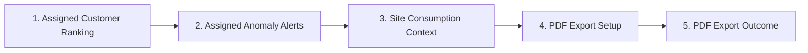

[CodeWiki](../../index.md) / [Specs](../index.md) / [Detailed Designs](index.md)

# EnerSight Account Manager Anomaly Follow-Up Journey

## Executive Summary

The highest-value MVP primary journey enables a Commercial Account Manager to turn detected consumption anomalies into an informed customer follow-up. The journey begins with only the account manager's assigned customers, prioritizes work using the approved ranking capability, exposes the assigned customer's anomaly alert, provides the authorized site consumption context and visual anomaly evidence, and finishes with a PDF report for the selected site and date range.

This five-screen journey uses only approved MVP stories: customer ranking (ENS-010), assigned anomaly alerts (ENS-008), daily consumption and period controls (ENS-003 and ENS-004), rolling four-week baselines (ENS-005), anomaly detection and accessible chart highlighting (ENS-006 and ENS-007), and authorized PDF export (ENS-012). It does not introduce alert acknowledgement, external notifications, customer-contact automation, threshold configuration, or other non-MVP behavior.

## Requirements

### Journey Name

**Assigned Customer Anomaly Review and PDF Follow-Up Preparation**

### User Persona

The primary user is a **Commercial Account Manager** who is responsible for a defined portfolio of commercial customers. The account manager needs to prioritize unusual consumption among assigned customers, understand the supporting site evidence, and prepare material for a customer conversation without seeing data for customers outside their assignment.

### User Goal

The account manager wants to identify the most important anomaly among assigned customers, inspect the related authorized site context, and export a PDF consumption report for the selected site and date range.

### Approved MVP Story Traceability

| Story ID | Approved MVP capability used in this journey |
| --- | --- |
| ENS-003 | View daily consumption for an authorized site and date range. |
| ENS-004 | Change between daily, weekly, and monthly consumption views. |
| ENS-005 | View a valid rolling four-week baseline beside daily actual consumption. |
| ENS-006 | Identify days whose actual consumption exceeds a valid baseline by more than the active threshold. |
| ENS-007 | Show anomaly days distinctly without relying only on color. |
| ENS-008 | Review alerts for assigned customers and open their authorized site context. |
| ENS-010 | Rank only assigned customers by anomaly count or deviation severity. |
| ENS-012 | Export an authorized PDF consumption report for an assigned site and date range. |

## Detailed Design

### End-to-End User Flow

1. The account manager opens the assigned-customer ranking and chooses the approved ranking criterion that best supports prioritization.
2. The account manager selects a ranked assigned customer with anomalies and opens the customer's available anomaly alerts.
3. The account manager opens a specific alert to navigate to the corresponding authorized customer-site consumption context.
4. The account manager reviews daily actual consumption, the valid rolling four-week baseline, and accessible anomaly highlighting, then chooses to export the selected site's report.
5. The account manager confirms PDF export for the authorized site and date range and receives a completed report outcome.

### Screen 1: Assigned Customer Ranking

**Purpose.** This screen gives the account manager a focused starting point for prioritizing follow-up across only their assigned customers. It prevents cross-portfolio exposure and makes the selected ranking criterion visible.

**User Actions.** The account manager selects either anomaly count or deviation severity as the ranking criterion, reviews the resulting ordered list, and opens an assigned customer with anomalies.

**Data Displayed.** The screen displays the active ranking criterion, the applicable configured ranking period, and an ordered list of assigned customers. Each available customer entry presents the information necessary to understand its relative priority under the active criterion. Customers not assigned to the authenticated account manager are not displayed.

**Success State.** The list is ordered according to the active criterion and shows only assigned customers. Selecting a customer with anomalies proceeds to that customer's assigned anomaly alerts.

**Loading State.** The screen indicates that assigned-customer ranking data is being retrieved or recalculated while retaining the page context and clearly avoiding presentation of a stale ordering as the refreshed result.

**Empty State.** When the account manager has no assigned customers with detected anomalies for the ranking period, the screen explains that there are no anomalies to prioritize. It does not imply that unassigned customers are available or display those customers.

**Error State.** When ranking data cannot be retrieved, the screen presents an actionable error that the assigned-customer ranking is unavailable and allows the account manager to retry. It does not reveal customer data outside the manager's assignments.

### Screen 2: Assigned Anomaly Alerts

**Purpose.** This screen lets the account manager review anomaly alerts for the selected assigned customer and choose the alert that requires investigation.

**User Actions.** The account manager reviews the alert list and opens a specific anomaly alert to inspect the associated site context. The account manager may return to the assigned-customer ranking to choose a different customer.

**Data Displayed.** Each alert displays the approved alert content: customer name, site, flagged date, deviation percentage, and suggested action. The list contains only alerts for customers assigned to the authenticated account manager.

**Success State.** Available alerts are shown with their required contextual fields. Opening an alert navigates to the related authorized customer-site consumption context.

**Loading State.** The screen indicates that alerts for the selected assigned customer are loading, without exposing alerts from other customers.

**Empty State.** When the selected assigned customer has no available anomaly alerts, the screen clearly states that there are no anomalies to review for that customer in the available alert data and offers a path back to the ranking screen.

**Error State.** When alerts cannot be retrieved, the screen displays an actionable error and a retry action. Authorization restrictions remain enforced, so the error response cannot expose alert details for unassigned customers.

### Screen 3: Site Consumption Context

**Purpose.** This screen provides the evidence needed to prepare a follow-up conversation by showing the authorized customer site's consumption, its valid rolling baseline, and the selected anomaly in context.

**User Actions.** The account manager reviews the selected site and date range, selects daily, weekly, or monthly aggregation as needed, inspects the anomaly context, and chooses the PDF export action. Daily view is used when reviewing the baseline and anomaly evidence because the approved baseline and anomaly rules are defined per day.

**Data Displayed.** The screen identifies the selected authorized customer site, active date range, and active aggregation period. In daily view, it displays one actual consumption value per calendar day and, where a valid calculation exists, the rolling four-week baseline. It identifies anomalies only where actual daily consumption exceeds a valid baseline by more than the active threshold, which defaults to 20 percent. Flagged days are distinguished with an accessible treatment that does not rely solely on color.

**Success State.** The selected alert's site and anomaly date are visible in the authorized consumption context. The chart accurately distinguishes the flagged day and displays actual consumption with a baseline only where the baseline is valid. The account manager can continue to export the selected site and date range as PDF.

**Loading State.** The screen shows that consumption, baseline, and anomaly results for the selected site, range, and aggregation are loading. It preserves the selected context labels while data is being retrieved or recalculated.

**Empty State.** When no accepted consumption data exists for the selected authorized site and date range, the screen explicitly states that no data is available. It must not render the absence of data as zero consumption. When there is insufficient approved history to calculate a daily baseline, the screen states that the baseline is unavailable for the affected day and does not portray a baseline value as valid.

**Error State.** When consumption context cannot be retrieved, the screen explains that the authorized site data is unavailable and provides a retry action. The screen does not show partial information as a completed calculation or expose an unauthorized site's data.

### Screen 4: PDF Export Setup

**Purpose.** This screen lets the account manager confirm an authorized PDF consumption report for the site and date range already examined in the anomaly context.

**User Actions.** The account manager confirms the selected assigned customer site and date range, chooses PDF as the report format, and requests the export. The account manager can return to the site consumption context to revise the selection before requesting the report.

**Data Displayed.** The screen displays the selected authorized site, selected date range, PDF format, and the fact that the resulting report represents the selected context. It does not present data for another site or an unauthorized date range.

**Success State.** A valid authorized selection with accepted consumption data can be submitted as a PDF export request and proceeds to the export outcome.

**Loading State.** After the export request, the screen communicates that the PDF report is being prepared. The approved MVP does not define whether processing is synchronous or asynchronous, so the experience must show visible progress until a final outcome is available.

**Empty State.** When no accepted consumption data exists for the authorized selected site and date range, the screen says that no exportable data is available. It does not generate a report that implies zero consumption.

**Error State.** When the request is unauthorized or cannot be completed, the screen clearly states that the PDF export is unavailable for the selected context and does not expose report data. For a recoverable service failure, it offers a retry action while retaining the authorized selection.

### Screen 5: PDF Export Outcome

**Purpose.** This screen completes the journey by making the successful report outcome clear and returning the account manager to the evidence or prioritization flow after an unsuccessful outcome.

**User Actions.** When the PDF report is available, the account manager obtains the report. The account manager can return to the selected site consumption context or return to the assigned-customer ranking to continue prioritizing follow-up work.

**Data Displayed.** On completion, the screen identifies the PDF report as belonging to the authorized selected site and date range. It does not expose report contents for another customer or site.

**Success State.** The screen confirms that the PDF consumption report is available for the authorized site and selected date range. This is the journey's end state because the account manager now has material to support the customer conversation.

**Loading State.** If report generation remains in progress, the screen continues to show a clear progress state until completion or failure. It does not claim that a report is ready before it is available.

**Empty State.** If the selected data becomes unavailable before export completion, the screen explains that there is no exportable data for the authorized selection and provides a route back to the site context.

**Error State.** If report generation fails, the screen communicates that the PDF report could not be completed and provides an actionable retry path. It must not expose report data after an authorization denial or failed export.

## Error Handling

Authorization boundaries apply at every screen. The ranking list must include only assigned customers, alert lists must exclude alerts for unassigned customers, navigation from an alert must resolve only to authorized site context, and PDF export requests must be denied without revealing report data when the selected site or date range is not authorized.

The journey distinguishes no-data conditions from technical failures. A no-data state communicates that no accepted consumption data or no exportable data exists for the selected authorized context; it must never be represented as zero consumption. A loading state communicates in-progress retrieval, calculation, or report generation. An error state communicates an unavailable or denied operation and offers retry only where retry is meaningful.

## Testing Strategy

The journey should be validated with representative assigned and unassigned customer-site data. Tests must verify that ranking orders only assigned customers by each approved criterion, alert records contain the required information and navigate to the related authorized site, and unassigned customer anomalies remain invisible.

Consumption-context tests must verify one daily value per calendar day, correct weekly and monthly aggregation labels, the 28-day preceding-window baseline rule, and the rule that a deviation exactly equal to 20 percent is not an anomaly. Accessibility tests must confirm that anomaly identification can be understood without color alone. Export tests must verify that an authorized account manager can request a PDF for an assigned site with accepted data, that no-data requests communicate the absence of exportable data, and that unauthorized requests reveal no report data.

## Implementation Plan

The delivery team should implement the screens as a connected, authorization-aware account-manager experience. The customer-ranking view should establish the selected assigned customer; the alert view should establish the selected alert and route to its associated site; the site context should preserve the selected site and date range when entering PDF export; and the export outcome should retain the same authorized selection for confirmation and recovery navigation.

The final interaction design must resolve the existing MVP TBDs that affect labels and calculations, including the ranking period, severity definition, default ranking, alert lifecycle, default date range, baseline minimum-data rule, and PDF report template and processing behavior. These decisions must not add scope beyond the approved MVP stories.

## Open Questions

The approved MVP does not yet define the ranking period, default ranking criterion, deviation-severity calculation, tie-breaking behavior, or treatment of assigned customers with no data. It also does not define the default dashboard date range, the final minimum-data rule for rolling-baseline availability, or whether PDF export completes synchronously or asynchronously.

The approved requirements leave the source of account-manager assignment and site authorization to be determined. They also leave the final suggested-action content, alert deduplication, alert lifecycle, report template, retention, and download behavior to be approved. These decisions affect the final UI wording and interaction details but do not alter the five-screen MVP journey.

## Related

This detailed design is linked to the [Commercial Energy Consumption Analytics and Anomaly Alerts MVP roadmap item](../../Artifacts/SpecBuilder/pages/roadmap_items/enersight-analytics-mvp.md) and is based on the approved MVP user-story JSON artifacts listed in the traceability table.
