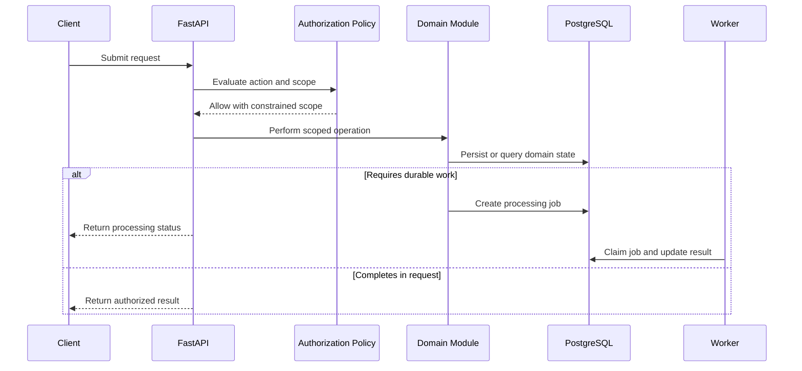

[CodeWiki](../../index.md) / [Specs](../index.md) / [Detailed Designs](index.md)

# EnerSight Analytics Core Modules Low Level Design

## Executive Summary

This Low Level Design defines responsibility boundaries, persisted state, sequencing, error behavior, and validation expectations for the EnerSight MVP core modules. It elaborates the approved architecture without providing implementation code. The design covers authorization, CSV ingestion, daily analytics, alerts and ranking, benchmarking, and exports.

The design assumes React with Tailwind CSS consumes FastAPI REST contracts, while FastAPI modules use SQLAlchemy to persist PostgreSQL records. Docker packages the runtime components. Identity, account-manager assignments, customer-site master data, peer-cohort governance, and report storage are integration boundaries whose final providers remain to be approved.

## Requirements

The modules must support the approved CSV-only ingestion path, daily, weekly, and monthly consumption views, a 28-day preceding-window baseline, strict greater-than-threshold anomaly detection, assigned account-manager alerts and ranking, anonymized benchmarks when available, and authorized CSV and PDF exports.

The modules must preserve authorization boundaries for every request and job. Invalid uploads cannot become accepted datasets, missing data cannot be represented as zero consumption, unavailable baselines and peer benchmarks must remain explicit states, and no report data may be disclosed after a failed authorization decision.

## Detailed Design

### Authorization Policy Module

The authorization module accepts an authenticated external subject and a requested action. It maps the subject to a local user representation and evaluates external or synchronized site grants and account-manager assignments. It produces an allow or deny decision and the constrained set of customer or site identifiers available to the calling module.

The module is invoked before upload creation, dashboard queries, benchmark lookup, alert listing, ranking calculation, export creation, export-status retrieval, and file download. Background jobs operate on resources already created through an authorized request but must verify that their output remains scoped to the originating resource.

### Ingestion Module

The ingestion module creates a `meter_upload` record before parsing and records the target site, uploader, checksum, received timestamp, and initial status. It validates the upload's required headers and row-level timestamp and numeric-kWh values under the approved policy. A rejected upload retains a safe validation summary and no accepted readings. A valid upload persists readings, records completion, and creates or continues analytics processing.

The final duplicate, partial-validity, size, row-limit, timestamp, timezone, and multi-site-file rules are not yet approved. Until then, the design requires explicit policy configuration and rejects or quarantines situations that cannot safely be classified as accepted.

### Daily Analytics Module

The analytics module groups accepted readings into site-local daily consumption values. For each evaluated day, it identifies the preceding 28 calendar days, excludes the evaluated day, and calculates a baseline only when the final minimum-data rule is met. It stores a nullable baseline when unavailable rather than substituting zero.

For a valid baseline greater than zero, the module calculates deviation as `(actual - baseline) / baseline * 100`. It sets the anomaly flag only when deviation is strictly greater than the threshold recorded for that calculation. The module writes calculation and policy-version information with derived results so that later approved recalculation rules can create a traceable new version.

### Alert and Ranking Module

The alert module receives newly persisted anomalous daily analytics, resolves the owning customer and approved active account-manager assignment, and creates an alert only when an assignee exists. Alert fields include the customer, site, anomaly date, actual and baseline context permitted by the product, deviation percentage, suggested-action policy version, and lifecycle state.

The ranking module queries only the authenticated manager's active assignments. It groups eligible anomaly results using the selected criterion of anomaly count or approved severity. The ranking period, severity definition, tie-breaking behavior, default criterion, and no-data treatment remain product decisions. The API must disclose the active criterion and period used by any result.

### Benchmark Module

The benchmark module accepts an already authorized site and a requested comparison period. It resolves the site business category and queries the approved peer-data adapter for a governed aggregate. If the adapter cannot prove cohort eligibility, minimum cohort size, or a valid comparison result, the module returns `unavailable` with a safe reason code. It never returns raw peer readings, peer identifiers, or an inferred average.

### Export Module

The export module creates an `export_request` only after it validates the requester's site access, selected date range, and requested format. A worker reads the same authorized scoped data used by the dashboard, produces the requested CSV or PDF artifact, writes it to approved file storage, and updates export status. Download must re-evaluate authorization and must not use an unprotected storage location.

### Module Interaction Sequence

## Error Handling

Authorization denial returns a safe forbidden or not-found-compatible response according to the approved security policy and does not reveal inaccessible resource details. Validation failures identify user-correctable CSV issues without exposing other uploads or sites. Processing failures transition the relevant upload or export to a terminal failed state with an actionable, safe category.

No-data, unavailable-baseline, and benchmark-unavailable are domain states rather than server failures. They should return successful responses with explicit state fields so the React application can communicate the distinction accurately. Calculation failures must not mark incomplete analytics as complete or generate alerts from invalid calculations.

## Testing Strategy

Validation must use representative authorized and unauthorized users, assigned and unassigned customers, valid and invalid CSVs, missing data, incomplete history, duplicate scenarios once policy is approved, and multiple site timezones. Analytics tests must verify the 28 preceding-day window, exclusion of the evaluated day, strict threshold behavior at 20 percent, and no anomaly where a baseline is unavailable.

Integration tests must verify that every dashboard, alert, ranking, benchmark, export, and download query is constrained by authorization. Export tests must verify status transitions, no-data outcomes, failed processing, and a second authorization check on retrieval. Accessibility validation must confirm that returned anomaly-state data supports non-color-only chart presentation.

## Implementation Plan

Implementation should proceed by establishing integration contracts for identity, customer-site master data, assignments, peer aggregates, and secure report storage; creating the PostgreSQL schema and SQLAlchemy mappings; then delivering authorization, ingestion, daily analytics, read APIs, alerts and rankings, benchmarks, and exports behind the approved feature flag. Each phase must use representative test data and retain the explicit unavailable and error states described in this design.

This sequence is architectural guidance rather than implementation code. The delivery team must not begin behavior affected by unresolved policy decisions without product approval.

## Open Questions

The final identity provider, assignment source, and customer-site authorization source are not selected. CSV validation and duplicate policies, site timezone policy, baseline minimum-data rule, threshold governance and historical recalculation behavior, ranking period and severity definition, peer cohort governance, export template, retention, service targets, and report-storage policy remain open.

## Related

This design elaborates the [EnerSight Analytics MVP Architecture](../ArchitectureSpecs/enersight-analytics-mvp-architecture.md) and complements the [EnerSight Account Manager Anomaly Follow-Up Journey](enersight-account-manager-anomaly-follow-up-journey.md).
