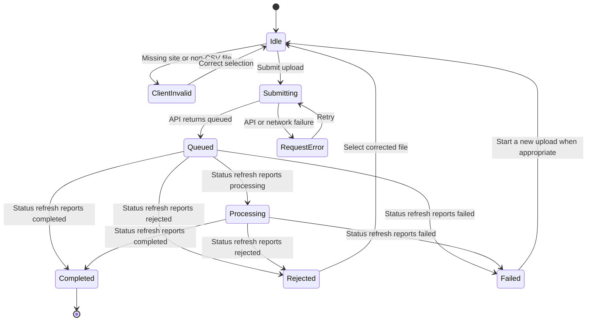

[CodeWiki](../../index.md) / [Specs](../index.md) / [Detailed Designs](index.md)

# EnerSight Stage 6 Frontend Implementation Design

## Purpose

This detailed design defines how the Stage 6 React frontend should realize the approved EnerSight MVP workflows without exceeding verified backend capability. It specifies the page composition, component responsibilities, API adapter behavior, state transitions, validation rules, loading and error treatment, responsive behavior, and implementation boundaries needed to build the frontend in a testable way.

The design uses the current backend source as the contract baseline. The backend has ten versioned `/api/v1` endpoints and a safe error envelope, but Stage 5 has no API execution results. Therefore, the design separates contract-based implementation from verified environment integration. It does not authorize a claim that any browser workflow has been executed against a working API.

## User Experiences

### Meter Data Operations Specialist

The operations user selects an authorized site, chooses a CSV file, submits the upload, and follows the returned lifecycle status. The screen must explain whether the upload is queued, processing, completed, rejected during validation, or failed. The user must not assume a submitted file is accepted until a completed status is returned.

The current backend validates a `.csv` filename at request time and validates file contents asynchronously. Its parser requires `timestamp` and `kwh` headers, timezone-aware ISO timestamps, and non-negative numeric kWh values. The frontend may use these known rules to improve preparation feedback, but it must render the API lifecycle and returned validation summary as authoritative.

### Commercial Customer Operations Lead

The customer selects an authorized site, an inclusive date range, and a daily, weekly, or monthly view. The screen requests consumption for the selected aggregation and requests daily analytics when daily baseline and anomaly information is needed. It also requests a peer benchmark independently and allows an authorized export request for the current site and range.

The customer sees explicit domain outcomes. A no-data result means no accepted consumption data exists for the selected range; it must not render a zero line or zero-valued table row. A baseline-unavailable day retains actual consumption when supplied but has no valid baseline or anomaly implication. A benchmark-unavailable response must never be converted into a guessed comparison.

### Commercial Account Manager

The account manager begins with a date range and the verified ranking criterion. The current backend only supports `anomaly_count`; therefore, the initial frontend must not ship an operational severity-ranking selector. The manager reviews ranked customer IDs received from the service and the assigned-alert list. Selecting an alert navigates to the associated authorized site consumption screen, passing optional alert context such as the anomaly date for focus after the destination reloads its server data.

The backend currently returns alert identifiers, customer IDs, site IDs, anomaly dates, deviation percentages, and status. The approved product calls for customer name, site name, and suggested action. The frontend must not invent those display values. The richer display should remain gated until the API provides verified fields or an approved authorized lookup route.

## Detailed Component Design

### Application Shell and Providers

`App` composes the router, approved authentication provider, query client, global live region, global error boundary, and Tailwind application styles. `AppShell` renders the application header, primary navigation, authenticated-session indicator, a bounded content container, and a skip link to the main route content.

`AuthProvider` supplies session state and a production-safe method of obtaining request credentials. It may expose coarse role claims for navigation affordances, but it does not replace API authorization. When session state is unauthenticated or expired, protected routes should guide the user to the approved sign-in flow rather than silently rendering a stale page.

`QueryClientProvider` owns server-state cache configuration. Query defaults should avoid aggressive automatic retries for authorization, validation, and feature-disabled responses. Retry may be appropriate for a transient network failure, but it must be bounded and visible to the user.

### Typed API Client

The API client owns the base URL, JSON request encoding, multipart upload construction, correlation header creation, safe error parsing, and download request behavior. Endpoint functions return typed models, not component-ready strings, so presentation components can format values consistently while retaining domain states.

```text
api/
  client.ts        Shared request, headers, JSON parsing, and safe error conversion.
  contracts.ts     TypeScript representations of the current public API schemas.
  meterUploads.ts  Create upload and read upload status operations.
  sites.ts         Read consumption, daily analytics, and benchmark operations.
  accountManager.ts Read alerts and customer ranking operations.
  exports.ts       Create export, read export status, and request download operations.
  errors.ts        Safe API error and transport-error discriminated unions.
```

Each request should include `X-Correlation-ID`. When the backend returns an `X-Correlation-ID` header or an error-envelope `correlation_id`, the client stores it only on the request result used by the calling UI. It must not write identifiers to publicly accessible analytics or browser storage.

The client should model normal domain states as success values. For example, `ConsumptionResponse.state === "no_data"` and `BenchmarkResponse.state === "unavailable"` are not thrown errors. A thrown or rejected client result is reserved for HTTP failures, malformed responses, and network failures.

### Upload Feature

`UploadPage` owns selected-site state, selected-file metadata, submit handling, and upload status presentation. `UploadForm` receives a list or selector model for sites only when an approved authorized site-list source exists. Because the inspected API does not define an endpoint to list sites, the frontend must not invent a customer/site discovery request. During development, the selector can receive controlled fixtures. Production implementation requires an approved authorized source of sites or an explicit server-provided context.

`useCreateUpload` submits a multipart request to `POST /meter-uploads?site_id={siteId}`. On success, it invalidates related upload queries and navigates to `/uploads/{uploadId}` or expands an outcome panel. `useUploadStatus` requests `GET /meter-uploads/{uploadId}` and polls only while the server reports `queued` or `processing`.

`UploadStatusCard` renders status-specific content. For `queued` and `processing`, it announces that validation and processing are not complete. For `completed`, it states that the data is available for downstream analytics. For `rejected`, it renders the API-safe validation summary. For `failed`, it renders the safe failure message or a general unavailable result. It must never display raw CSV content, checksums, internal jobs, or unrelated site information.

### Consumption Feature

`ConsumptionPage` derives `siteId`, `fromDate`, `toDate`, and `granularity` from route and controlled form state. It validates range ordering before issuing requests. `useConsumption` reads the aggregation endpoint for every selected granularity. `useDailyAnalytics` runs when the user selects daily mode, because daily analytics supplies baseline, deviation, threshold, anomaly flag, and baseline state. The page may retain a separate daily analytics panel in other modes only if the product design requires it and labels it clearly as daily evidence, not as an aggregate baseline.

`ConsumptionControls` owns the date-range fields and a daily/weekly/monthly selector. A changed control creates a pending selection and requests a new result only after validation. The page should prevent accidental mixed-state presentation by pairing response metadata with the selection that produced it.

`ConsumptionChart` accepts normalized chart rows. Each daily row includes date, actual kWh, optional baseline kWh, optional deviation percent, threshold percent, anomaly flag, and state. Weekly and monthly rows include period start, period end, and total kWh. The chart never computes an anomaly, baseline, weekly aggregate, or monthly aggregate itself. `ChartDataTable` renders the same information in a screen-reader and keyboard-friendly form and remains available at every viewport width.

`BenchmarkPanel` requests the benchmark endpoint independently. A successful unavailable response displays a concise explanation and safe reason mapping, such as peer comparison not configured. It does not show peer average, percentage, or comparison direction unless the response state is available and both relevant values are present.

### Account-Manager Feature

`AccountManagerDashboardPage` owns a valid date range and calls ranking and alerts queries. `RankingPanel` displays only server-returned rows. The inspected endpoint supports `criterion=anomaly_count`; it should render that value as the active method. Any future severity option must be introduced only after the contract includes an enum value and Stage 5 verifies it.

`AlertListPanel` displays only fields returned by `AlertResponse`. `AlertRow` links to the site consumption route using the returned `site_id` and can carry the `anomaly_date` as local navigation focus context. It must not assume that an alert-detail route exists, that alert IDs can resolve without list context, or that a site route confirms the selected alert remains available.

### Export Feature

`ExportDialog` begins with the current authorized site and range from the site page. The user selects a verified output format and confirms the request. The inspected API accepts `csv` and `pdf`, but the current worker marks PDF as rejected with `pdf_storage_not_configured`, and the download route streams only completed CSV. The user experience should therefore expose CSV as actionable and PDF as unavailable until the backend implementation and Stage 5 verification demonstrate a completed and protected PDF path.

`useCreateExport` posts the ordered date range, selected site, and output format. `ExportStatusPanel` reads the lifecycle status and polls only for `queued` or `processing`. It enables a download button only when the response has `download_available: true`. The download action makes a new authenticated request to the download endpoint; it must not trust a cached URL or prior authorization state.

## API Model Mapping

| Endpoint model | Frontend type and consumer | Required rendering constraints |
| --- | --- | --- |
| `UploadResponse` | `UploadResult`; `UploadStatusCard` | Render `id`, `site_id`, `status`, and safe `validation_summary` only. |
| `ConsumptionResponse` | `ConsumptionResult`; `ConsumptionPanel` | Render the selected dates, granularity, response state, and `PeriodValue` rows. A no-data state is not a zero result. |
| `DailyAnalyticsResponse` | `DailyAnalyticsResult`; `ConsumptionChart` in daily view | Render nullable baseline and deviation accurately. A baseline-unavailable day must not be treated as anomalous. |
| `BenchmarkResponse` | `BenchmarkResult`; `BenchmarkPanel` | Render values only when state is available. Map unavailable reason safely. |
| `AlertsResponse` | `AlertsResult`; `AlertListPanel` | Render only returned alert fields; do not supply missing customer/site names or suggested action. |
| `RankingResponse` | `RankingResult`; `RankingPanel` | Render API order and criterion. Do not client-sort into a different order. |
| `ExportResponse` | `ExportResult`; `ExportStatusPanel` | Enable download only when `download_available` is true. Render safe failure category when returned. |
| `ErrorResponse` | `ApiError`; all route-level error states | Render only safe message, optional field details, and correlation identifier. |

## UX State Specifications

### Upload State Machine



The `Submitting` state exists only until the create-upload response is received. The page must not invent a terminal result when a request fails before the server returns an upload ID. A known upload status may be refreshed on demand, but automatic polling must stop after a terminal state or a bounded polling error.

### Consumption State Model

The consumption page has independent state for aggregation, daily analytics, and benchmark data. Aggregation and daily analytics share site and range context but have distinct API responses. This prevents a slow benchmark or unavailable baseline from blocking the entire consumption view.

| Data region | Loading | Available | Empty or unavailable | Error |
| --- | --- | --- | --- | --- |
| Consumption aggregation | Preserve selected controls; reserve chart/table space. | Render selected period rows. | Render no-data message with no zero plot. | Render retryable safe technical or unavailable-resource state. |
| Daily analytics | Render an analytics loading label in daily mode. | Render actual, baseline where valid, deviation, threshold, and marker. | Render overall no-data or per-day baseline unavailable state. | Do not retain a prior day’s anomaly marker for a new failed range. |
| Benchmark | Render panel-level loading. | Render only API-supplied eligible comparison. | Render benchmark unavailable with safe explanation. | Render local panel error without discarding consumption data. |
| Export | Keep context and confirmation controls visible. | Render a downloadable completed CSV only after status says so. | Render rejected/failed/no-data outcome if provided. | Render safe retry option without losing valid selection. |

### Account-Manager State Model

Ranking and alerts should load independently. A ranking no-data state does not imply no alerts in all cases, and an alerts no-data state does not establish that no customer data exists outside the manager's portfolio. The page must state only the scoped result returned by the server.

The ranking panel should not implement client-side severity sorting, customer enrichment, or simulated assignment filtering. The alert panel should not request or expose an alert outside the returned list. If a user follows a stale alert link and the destination site request returns resource unavailable, the site page must show the safe unavailable state and avoid explaining whether access changed or the site was removed.

## Form Behavior and Error Presentation

A form uses a controlled field model consisting of current value, touched state, client validation result, server validation result, and submission state. Client validation appears after a field is touched or after submit. Server validation error details are shown after a response, associated with the returned field path when possible, and cleared when the user changes the relevant field.

The upload form validates a selected site and a `.csv` file extension. It must not parse the file to assert acceptance or infer CSV policy beyond approved user guidance. The date-range fields validate ISO-compatible dates and chronological ordering. The granularity selector accepts `daily`, `weekly`, and `monthly`. The ranking selector accepts only values present in the typed backend enum. The export form requires a selected site, valid dates, and an enabled output format.

Focus behavior is mandatory. When submit fails validation, focus moves to the error summary or first invalid field. When a polling state changes to completed, rejected, or failed, the status region announces the outcome but should not unexpectedly move focus. When an export is completed, the download button becomes available and is announced through a polite live region.

## Responsive and Accessible Component Rules

The primary dashboard layout uses a maximum readable content width, a grid for wide viewports, and stacked panels when space becomes constrained. Date controls stack vertically on narrow screens. The upload form uses a full-width file chooser and a clearly visible selected-file label. Primary actions remain reachable without horizontal scrolling.

Charts must have a visible chart title, a caption that identifies selected site, range, and granularity, a legend that describes actual, baseline, and anomaly symbols, and a tabular alternative. An anomaly must use more than a color: for example, a distinct point marker plus label and table status. A baseline-unavailable record must have a text-equivalent unavailable state. Tooltips cannot be the only way to access essential information.

Tables should retain semantic headers and responsive overflow only when column collapse would remove essential meaning. Ranking and alert list rows may become stacked definition-style cards on narrow screens, but rank, customer identifier, anomaly count, site identifier, anomaly date, deviation, and status must remain associated with labels.

## Implementation Sequence

1. Establish the React application shell, routing, Tailwind design tokens, authentication-provider boundary, typed API client, safe error model, correlation ID hook, test rendering helper, and global feedback primitives. Use fixtures rather than a live API for this step.

2. Implement the consumption screen and its controlled date and granularity controls, aggregation panel, daily analytics chart/table, benchmark-unavailable rendering, responsive layout, and non-color anomaly treatment. Test available, no-data, baseline-unavailable, unavailable benchmark, invalid range, and safe API error outcomes.

3. Implement the operations upload screen, upload status route, lifecycle display, and bounded polling. Use mocked queued, processing, completed, rejected, and failed fixtures. Do not claim real CSV processing until Stage 5 verification completes.

4. Implement the account-manager dashboard with anomaly-count ranking and alert list behavior. Use only current response fields, then provide alert-to-site navigation using returned site IDs and reloaded destination data. Treat severity ranking, display-name enrichment, and suggested actions as pending API-contract work.

5. Implement the export dialog, CSV status lifecycle, direct download behavior, and PDF-unavailable treatment. Keep the completed PDF flow disabled until protected storage, template, API behavior, and Stage 5 verification are available.

6. Connect browser integration tests to the restored non-production backend only after the Stage 5 matrix executes. Validate CORS, authentication integration, contract response bodies, authorization-negative behavior, job lifecycle transitions, download response behavior, and representative role journeys.

## Verification Boundaries

The frontend team can verify component behavior with controlled contract fixtures before Stage 5 completion. Such verification covers client validation, route state, responsive layout, keyboard interactions, focus management, live announcements, no-data rendering, baseline-unavailable rendering, safe error display, chart alternatives, and polling logic.

The frontend team cannot verify live browser-to-backend interaction until Stage 5 provides runnable API evidence. In particular, actual CORS settings, credential/session handling, endpoint status codes, safe response envelopes, server validation details, upload queue processing, worker scheduling, baseline and anomaly results, portfolio isolation, benchmark behavior, export states, revoked-access denial, and CSV download semantics remain unverified in an executable environment.

## Related Documentation

This design implements the [EnerSight Stage 6 Frontend Architecture](../ArchitectureSpecs/enersight-stage-6-frontend-architecture.md). It follows the approved [Commercial Energy Consumption Analytics and Anomaly Alerts](../FeatureSpecs/commercial-energy-consumption-analytics-anomaly-alerts.md) scope and the [EnerSight Account Manager Anomaly Follow-Up Journey](enersight-account-manager-anomaly-follow-up-journey.md). It maps to the current backend contract in `backend/app/main.py` and `backend/app/schemas.py` and respects the unresolved verification position in the [Stage 5 API Test Execution Evidence](../../Quality/BackendQA/stage-5-api-test-execution-evidence.md).
