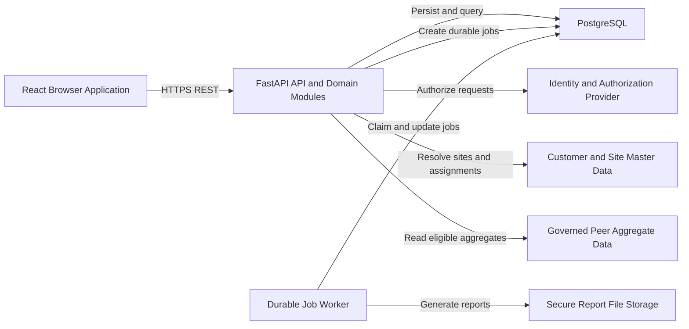
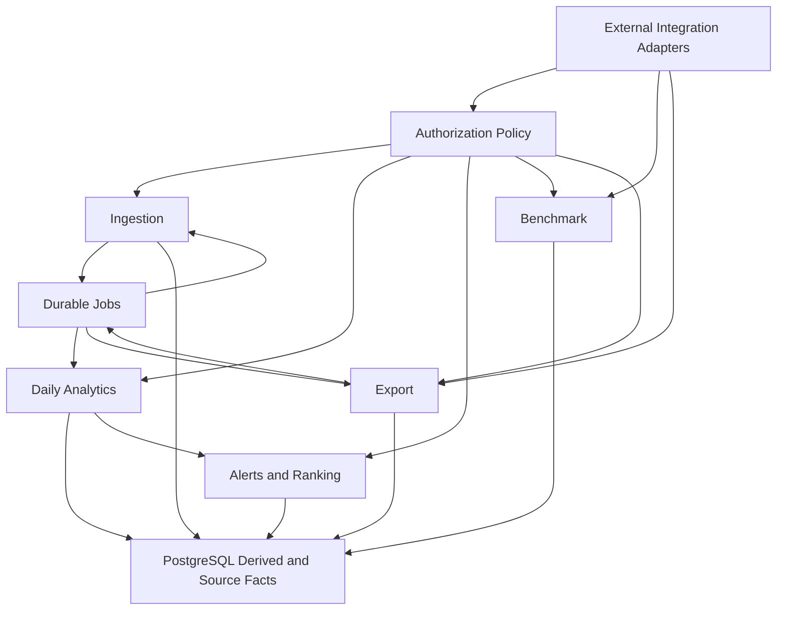

# EnerSight Analytics Approved Design Summary

[CodeWiki](../../index.md) / [Specs](../index.md) / [Other Specifications](index.md)

## Purpose

This document summarizes the approved product and technical design context for the EnerSight Analytics MVP. It consolidates the architecture, backend responsibilities, data entities, API surface, business rules, and module dependencies without prescribing implementation code, file-level changes, or delivery sequencing.

The MVP is an analytics and alerting layer for commercial energy-consumption data. It accepts authorized CSV meter-reading uploads, derives consumption and anomaly insights, provides role-constrained views for commercial customer users and account managers, offers governed peer comparisons when eligible data exists, and produces authorized CSV or PDF reports.

## Architecture Overview

EnerSight is designed as a modular monolith deployed as Docker-packaged components. A React application styled with Tailwind CSS provides the browser experience. A FastAPI service exposes the versioned REST API, applies authorization, coordinates domain modules, and manages durable processing. PostgreSQL is the system of record for customer and site metadata, accepted readings, derived analytics, alerts, export lifecycle records, jobs, and audit evidence. SQLAlchemy is the persistence abstraction used by the backend.

The design intentionally avoids a microservices-first approach for the MVP. The product domain is cohesive and needs reliable consistency among authorization decisions, accepted uploads, derived daily analytics, alerts, rankings, and exports. Clear module boundaries and durable jobs preserve the option to extract or independently scale processing responsibilities later if measured demand justifies it.

Identity, customer-site master data, account-manager assignments, peer-cohort governance, secure report storage, and the final job-queue mechanism are external integration boundaries. Their providers and detailed contracts remain subject to approval and are not invented by this design.

## Major Backend Modules

### Authorization Policy Module

The authorization policy module converts an authenticated external subject into an allow-or-deny decision with constrained customer and site scope. It evaluates role, site-access grants, customer access, and account-manager assignments before any upload, dashboard read, benchmark lookup, alert query, ranking query, export action, or download is performed.

Authorization is a server-side responsibility. The browser application receives only data already constrained to the principal's permitted scope, and an unauthorized response must not reveal whether an inaccessible customer, site, alert, upload, or export exists.

### Ingestion Module

The ingestion module accepts a CSV file for one authorized target site, creates an immutable `meter_upload` provenance record, validates the CSV structure and row values, and schedules processing. Required input includes timestamp and kWh data. A valid upload persists accepted readings and begins or continues analytics processing; an invalid upload retains a safe validation outcome but cannot become a usable analytics dataset.

The exact CSV header names, timestamp and timezone rules, duplicate policy, partial-validity handling, file-size and row limits, and multi-site-file policy remain unresolved. Until these policies are approved, ambiguous input must be rejected or quarantined rather than silently accepted.

### Daily Analytics Module

The analytics module transforms accepted meter readings into site-local daily consumption facts and then calculates daily baselines, deviations, and anomaly status. It persists derived results with calculation and policy versions so that historical charts, exports, rankings, and alerts remain explainable if approved policies change later.

Weekly and monthly consumption views aggregate accepted daily data for the selected calendar period. The design requires explicit no-data and unavailable-calculation states rather than representing missing information as zero consumption.

### Alert and Ranking Module

The alert module creates an account-manager alert for an eligible anomaly only when an active approved assignment exists. An alert is associated with the customer, site, anomaly calculation, assignee, suggested-action policy version, and lifecycle state. Alerts support navigation to the authorized site context but do not grant additional access.

The ranking module returns only the authenticated manager's assigned customers. It orders eligible customers using anomaly count or an approved deviation-severity definition for an approved period, while identifying the criterion and period used in the result.

### Benchmark Module

The benchmark module receives an already authorized site and comparison period, identifies the site business category, and queries an approved peer-data adapter for a governed anonymized aggregate. It returns a comparison only if cohort eligibility and suppression rules are satisfied. If they are not satisfied, the module returns an explicit unavailable state with a safe reason code.

The module must never expose raw peer readings, peer identities, site-level peer values, or an inferred comparison derived from insufficient data.

### Export Module

The export module authorizes the requested site, date range, and output format before creating an `export_request`. A durable worker uses the same authorized analytic data boundary as the dashboard to produce CSV or PDF files in secure external storage. The module records status transitions and re-evaluates authorization when a completed file is retrieved.

Report content, PDF template, file-size limits, retention, expiry, signed-download policy, and service targets are not yet finalized.

### Integration Adapters and Durable Jobs

Integration adapters isolate the MVP from unapproved external-provider details for identity, site master data, customer assignments, business categories, peer aggregates, and storage. Durable jobs support ingestion, calculation, alert creation, and report generation that may outlast an HTTP request. Job records expose observable states including `queued`, `processing`, `completed`, `failed`, and `rejected`.

## Database Entities

The database design uses PostgreSQL foreign keys and indexed relationships to preserve source-data provenance, authorization boundaries, derived analytic history, and operational auditability.

| Entity | Purpose | Principal Relationships |
| --- | --- | --- |
| `customer` | Represents a commercial customer organization. | Owns one or more sites and can be assigned to account managers. |
| `site` | Represents a metered customer site and its business context. | Belongs to a customer and is associated with uploads, readings, daily facts, benchmarks, and exports. |
| `user_account` | Locally represents an external identity and role. | Receives site grants, holds account-manager assignments, requests exports, and receives alerts. |
| `site_access_grant` | Defines authorized site access for customer and operational users. | Connects a user to a permitted site for an effective interval. |
| `account_manager_assignment` | Defines a manager's active customer portfolio. | Connects an account manager to a customer for an effective interval. |
| `meter_upload` | Retains immutable CSV submission and validation provenance. | Belongs to a site and uploader; contains accepted readings after successful processing. |
| `meter_reading` | Stores accepted timestamped kWh input values. | Belongs to an upload and site; supplies daily calculations. |
| `daily_consumption` | Stores derived site-local daily consumption. | Belongs to a site and has a calculation version and coverage state. |
| `daily_analytic` | Stores baseline, deviation, threshold, and anomaly results. | Evaluates one daily-consumption record and can produce an alert. |
| `anomaly_alert` | Stores account-manager-facing eligible anomaly alerts. | References the analytic result, customer, site, and assigned user. |
| `benchmark_snapshot` | Stores or represents governed peer comparison output. | Associates a site and period with a cohort-policy version and availability result. |
| `export_request` | Records an authorized CSV or PDF export request and outcome. | References the requester and site and can include a secure storage reference. |
| `processing_job` | Tracks durable asynchronous work and retry outcomes. | Processes uploads or generates export artifacts. |
| `audit_event` | Provides security and operational evidence without raw readings. | Records an actor, action, resource, outcome, timestamp, and correlation identifier. |

## API Endpoints

All application endpoints are versioned beneath `/api/v1`, require authentication, and use JSON except multipart upload and file-download responses. Errors use a stable machine-readable code, a user-safe message, and optional details. Endpoint paths below are relative to the `/api/v1` prefix.

| Endpoint | Method | Authorized Use | Summary |
| --- | --- | --- | --- |
| `/meter-uploads` | `POST` | Authorized data-operations user | Upload a CSV and target `site_id`; returns upload and processing status. |
| `/meter-uploads/{upload_id}` | `GET` | Upload creator or authorized operational role | Read authorized upload provenance, validation outcome, and processing status. |
| `/sites/{site_id}/consumption` | `GET` | Authorized site viewer | Retrieve daily, weekly, or monthly consumption for a date range. |
| `/sites/{site_id}/daily-analytics` | `GET` | Authorized site viewer | Retrieve daily actuals, valid baselines, deviations, and anomaly flags. |
| `/sites/{site_id}/benchmark` | `GET` | Authorized customer site viewer | Retrieve an eligible benchmark or an explicit unavailable state. |
| `/account-manager/alerts` | `GET` | Assigned account manager | List alerts only for the manager's assigned customers. |
| `/account-manager/customer-ranking` | `GET` | Assigned account manager | Return assigned-customer ranking by approved criterion and period. |
| `/exports` | `POST` | Authorized site viewer | Create a CSV or PDF export for an authorized site and date range. |
| `/exports/{export_id}` | `GET` | Requester or separately authorized user | Read export status and an authorized download reference when ready. |
| `/exports/{export_id}/download` | `GET` | Authorized export viewer | Download the generated CSV or PDF after a second authorization check. |

Long-running operations must expose durable status rather than claim completion before the work has finished. No-data, unavailable-baseline, and benchmark-unavailable outcomes are successful domain states, not server errors.

## Key Business Rules

### Meter-Data Acceptance

Only authorized users may upload a CSV for an authorized customer site. A usable dataset is created only when required columns are present and accepted rows contain parseable timestamps and numeric kWh values under the final approved validation policy. Failed validation must not create accepted readings, consumption analytics, anomalies, alerts, or exports.

### Consumption Aggregation

Accepted meter readings are aggregated into daily site-local consumption. The dashboard can display daily, weekly, and monthly consumption over a selected date range. If accepted data is absent for the selected site and range, the system must show an explicit no-data state and must not render the absence as zero consumption.

### Rolling Baseline

For an evaluated daily consumption value, the rolling baseline uses the 28 calendar days immediately preceding that day. The evaluated day is excluded from the window. A baseline remains unavailable when the site fails the final approved minimum-data rule, and the system must not substitute a zero baseline.

### Anomaly Detection

For a valid baseline greater than zero, deviation is calculated as `(actual - baseline) / baseline * 100`. A day is anomalous only when its deviation is strictly greater than the active threshold. The default threshold is 20 percent; therefore, an actual value of 120 kWh against a 100 kWh baseline is not anomalous, while 121 kWh is anomalous.

A day without a valid baseline cannot be classified as anomalous. Derived daily facts record the threshold and calculation-policy version used so that outcomes remain interpretable if policy is later changed.

### Alerts and Ranking

An alert is created only for an eligible anomaly at a site whose customer has an active assigned account manager. An account manager can view only alerts and ranked customers within their active assignment portfolio. The ranking criterion is anomaly count or an approved deviation-severity measure, and every ranking response identifies the active criterion and ranking period.

### Peer Benchmarking

A peer benchmark is returned only from an approved, anonymized aggregate when category, period, cohort eligibility, and suppression rules are satisfied. The product must return a benchmark-unavailable state when it cannot safely calculate a comparison. It must not disclose identifiable peer information or construct an inferred peer average.

### Exports and Auditability

CSV and PDF exports require authorization for the selected site and date range. Generated files are stored securely outside the database, and access is verified both when the export is requested and when it is downloaded. Uploads, calculations, access outcomes, job lifecycle events, and export events produce audit or telemetry evidence without recording raw meter readings unnecessarily.

## Dependencies Between Modules

The following dependency flow describes the approved module relationships. Authorization is a prerequisite for every user-initiated operation, while durable processing coordinates work that should not be completed inside the original browser request.

The ingestion module depends on authorization to establish the target-site scope and on durable jobs to process files safely. Daily analytics depends on accepted readings and site context. Alert generation and customer ranking depend on persisted analytic outcomes plus active account-manager assignments. Benchmarking depends on site authorization, business-category data, and governed peer aggregates. Exports depend on authorization, derived analytics, durable generation jobs, and secure file storage.

## Decisions Still Requiring Confirmation

The design is sufficient to describe the intended product and technical boundaries, but several policy and provider decisions remain open. These include the identity and authorization provider, customer-site and account-manager assignment sources, detailed CSV validation and duplicate policy, timezone treatment, baseline minimum-data rule, anomaly-threshold governance, historical recalculation behavior, ranking-period and severity definitions, peer cohort and suppression policy, report template and retention requirements, job-queue technology, measurable service targets, and accessibility conformance details.

No implementation artifacts should be generated for these unresolved areas until the relevant product, security, data-governance, and operational decisions have been confirmed.
